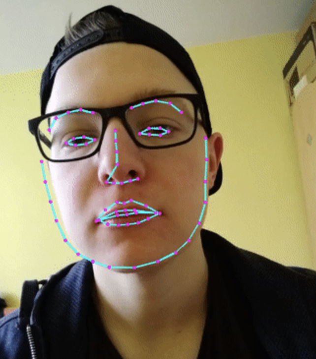

## 仿抖音左右歪头图片选择

- [在线体验](https://srect.github.io/face-api.js)

- [项目 github 仓库](https://github.com/sRect/face-api.js/tree/dy)


> 前一阵子在刷抖音时，看到一个通过左右歪头选择两侧图片的视频，感觉很有趣。顿时想到了 n 年前的[**face-api.js**](https://github.com/justadudewhohacks/face-api.js)，那就基于这个来做吧。总体做好后，有很多细节需要改进，不够细腻丝滑。

### 1. 需求分析

直接开搞吧！

1. 页面基本布局，左右两侧图片，而且有缩放和移动动画
2. 需要打开摄像头，获取视频流，通过 video 展现出来
3. 需要检测人脸是向哪一侧歪头

### 2. 具体实现

#### 2.1 页面布局和 animation 动画

这个不难，布局好后，就是添加 css 动画，我这里写的很粗糙，不细腻，但勉强能用，例如下面 _leftHeartMove_ 为中间的小爱心向左侧移动动画

```css
.heart {
  width: 30px;
  height: 30px;
  padding: 4px;
  box-sizing: border-box;
  border-radius: 50%;
  background-color: #fff;
  position: absolute;
  top: -15px;
  left: 50%;
  transform: translateX(-50%) rotateZ(0deg) scale(1);
  animation: leftHeartMove 0.5s linear;
  animation-fill-mode: forwards;
  z-index: 2;
}

@keyframes leftHeartMove {
  from {
    top: -15px;
    left: 50%;
    transform: translateX(-50%) rotateZ(0deg) scale(1);
  }

  to {
    top: 65px;
    left: -13%;
    transform: translateX(-50%) rotateZ(-15deg) scale(1.2);
  }
}
```

#### 2.2 打开摄像头并显示

**注意点**

1. 关于 h5`navigator.mediaDevices.getUserMedia` 这个 api，本地开发`localhost`是可以拉起摄像头打开提示的，线上部署必须是`https`节点才行，`http`不能唤起打开摄像头


2. 关于获取到视频流后，`video`视频播放，需要镜面翻转，这个可以通过 css 的`transform: rotateY(180deg)`来翻转

3. 关于`video`播放不能在手机上竖屏全屏，可以给 video 设置 css`object-fit:cover`来充满屏幕

```html
<video id="video" class="video" playsinline autoplay muted></video>
```

```css
.video {
  width: 100%;
  height: 100%;
  transform: rotateY(180deg);
  object-fit: cover;
}
```

- 获取摄像头视频流

```javascript
async getUserMedia() {
  if (navigator.mediaDevices && navigator.mediaDevices.getUserMedia) {
    try {
      // https://developer.mozilla.org/en-US/docs/Web/API/MediaDevices/getUserMedia#examples
      const stream = await navigator.mediaDevices.getUserMedia({
        audio: false,
        video: true,
        video: {
          facingMode: "user", // 前置摄像头
          // facingMode: { exact: "environment" }，// 后置摄像头
          width: { min: 1280, max: 1920 },
          height: { min: 720, max: 1080 },
        },
      });

      return Promise.resolve(stream);
    } catch (error) {
      return Promise.reject();
    }
  }

  const errorMessage =
    "This browser does not support video capture, or this device does not have a camera";
  alert(errorMessage);
}
```

- video 播放视频流

```javascript
async openCamera(e) {
  try {
    const stream = await this.getUserMedia();
    this.video.srcObject = stream;
    this.video.onloadedmetadata = async () => {
      this.video.play();
    };
  } catch (error) {
    console.log(error);
    alert("打开摄像头失败");
  }
}
```

- 关闭视频

```javascript
async closeCamera() {
  // https://developer.mozilla.org/en-US/docs/Web/API/MediaStreamTrack/stop
  const tracks = this.video.srcObject.getTracks();

  tracks.forEach((track) => {
    track.stop();
  });

  this.video.srcObject.srcObject = null;
}
```

#### 2.3 检测人脸左右倾斜



通过`face-api.js`拿到人脸`landmarks`特征数据后，可以直接拿到左右眼的数据，分别通过求 Y 轴方向的平均值，然后比较这个平均值，便可以简单得出人脸向左还是向右倾斜，简单吧，角度都不用求了！

```html
<div style="position: relative;width: 100%;height: 100%;">
  <video
    id="video"
    class="video"
    playsinline
    autoplay
    muted
    style="object-fit:cover"
  ></video>
  <canvas id="overlay" class="overlay"></canvas>
</div>
```

```css
.video {
  width: 100%;
  height: 100%;
  position: absolute;
  top: 0;
  left: 0;
  z-index: 0;
  transform: rotateY(180deg);
}

.overlay {
  position: absolute;
  top: 0;
  left: 0;
}
```

- 加载模型

```javascript
import * as faceapi from "face-api.js";

async loadWeight() {
  // 加载模型
  await faceapi.nets.ssdMobilenetv1.load(
    "./static/weights/ssd_mobilenetv1_model-weights_manifest.json"
  );
  // 加载人脸68特征模型数据
  await faceapi.nets.faceLandmark68Net.load(
    "./static/weights/face_landmark_68_model-weights_manifest.json"
  );
  // await faceapi.nets.faceExpressionNet.load(
  //   "/static/weights/face_expression_model-weights_manifest.json"
  // );
  // await faceapi.nets.faceRecognitionNet.load(
  //   "./static/weights/face_recognition_model-weights_manifest.json"
  // );
  await faceapi.nets.ageGenderNet.load(
    "./static/weights/age_gender_model-weights_manifest.json"
  );

  console.log("模型加载完成");
}
```

- 计算人脸左右倾斜

```javascript
handleFaceLeftOrRight(landmarks) {
  const DIFF_NUM = 15; // 偏差
  let leftEye = landmarks.getLeftEye(); // 左眼数据
  let rightEye = landmarks.getRightEye(); // 右眼数据
  // let nose = landmarks.getNose();

  let leftEyeSumPoint = leftEye.reduce((prev, cur) => ({
    x: prev.x + cur.x,
    y: prev.y + cur.y,
  }));

  let rightEyeSumPoint = rightEye.reduce((prev, cur) => ({
    x: prev.x + cur.x,
    y: prev.y + cur.y,
  }));

  // let noseSumPoint = nose.reduce((prev, cur) => ({
  //   x: prev.x + cur.x,
  //   y: prev.y + cur.y,
  // }));

  let leftEyeAvgPoint = {
    x: leftEyeSumPoint.x / leftEye.length,
    y: leftEyeSumPoint.y / leftEye.length,
  };

  let rightEyeAvgPoint = {
    x: rightEyeSumPoint.x / leftEye.length,
    y: rightEyeSumPoint.y / leftEye.length,
  };

  // let noseAvgPoint = {
  //   x: noseSumPoint.x / leftEye.length,
  //   y: noseSumPoint.y / leftEye.length,
  // };

  // console.log(leftEyeAvgPoint, rightEyeAvgPoint, noseAvgPoint);
  let diff = Math.abs(leftEyeAvgPoint.y - rightEyeAvgPoint.y);

  return diff > DIFF_NUM
    ? leftEyeAvgPoint.y > rightEyeAvgPoint.y
      ? "left"
      : "right"
    : "center";
}
```

- 分析 video 视频流

```javascript
async handleVideoFaceTracking(cb) {
    if (this.closed) {
      window.cancelAnimationFrame(this.raf);
      return;
    }

    const options = new faceapi.SsdMobilenetv1Options();

    let task = faceapi.detectAllFaces(this.video, options);
    task = task.withFaceLandmarks().withAgeAndGender();
    const results = await task;

    // overlay为canvas元素
    // video即为video元素
    const dims = faceapi.matchDimensions(this.overlay, this.video, true);
    const resizedResults = faceapi.resizeResults(results, dims);

    // console.log("options==>", options);
    // console.log("resizedResults==>", resizedResults);
    cb && cb(resizedResults);

    this.raf = requestAnimationFrame(() => this.handleVideoFaceTracking(cb));
  }
```

### 3. 参考资料

1. [face-api.js](https://github.com/justadudewhohacks/face-api.js)

2. [getUserMedia MDN](https://developer.mozilla.org/en-US/docs/Web/API/MediaDevices/getUserMedia#examples)
