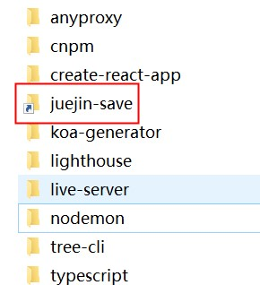

- [npm package](https://www.npmjs.com/package/juejin-save)
- [github 源码仓库](https://github.com/sRect/juejin-save)

### 安装

```bash
npm i juejin-save -g
```

### 使用

```
juejin-save save https://xxx
```

### 效果


---

### 1. 主要 package version

> 注意：文章重点在于打造 cli，不是 puppeteer

| package                                                                                      | version | 功能                               |
| :------------------------------------------------------------------------------------------- | :------ | :--------------------------------- |
| [commander](https://github.com/tj/commander.js/blob/HEAD/Readme_zh-CN.md#%E5%91%BD%E4%BB%A4) | ^9.0.0  | 创建处理命令                       |
| [inquirer](https://github.com/SBoudrias/Inquirer.js/#objects)                                | ^8.2.0  | 处理交互                           |
| [ora](https://www.npmjs.com/package/ora)                                                     | ^5.4.1  | 处理 loading                       |
| [puppeteer](https://github.com/puppeteer/puppeteer)                                          | ^13.3.2 | 通过 api 来控制 Chromium 或 Chrome |

### 2. 项目目录结构

```
├── bin
|  └── cli.js          // 入口文件
├── LICENSE
├── package-lock.json
├── package.json
├── puppeteer.js       // puppeteer保存文章文件
└── README.md
```

### 2. package.json 中添加`bin`字段

> 添加`juejin-save`命令，指定运行文件为 bin 目录 cli.js

```diff
+ {
+   "bin": {
+     "juejin-save": "bin/cli.js"
+   }
+ }
```

### 3. 主要 package api 介绍

#### 3.1 commander

```javascript
const { Command } = require("commander");
const program = new Command();

program
  .command("clone <source> [destination]")
  .description("clone a repository into a newly created directory")
  .action((source, destination) => {
    console.log("clone command called");
  });

program.parse();
```

#### 3.2 inquirer

```javascript
var inquirer = require("inquirer");
inquirer
  .prompt([
    /* Pass your questions in here */
  ])
  .then((answers) => {
    // Use user feedback for... whatever!!
  })
  .catch((error) => {
    if (error.isTtyError) {
      // Prompt couldn't be rendered in the current environment
    } else {
      // Something else went wrong
    }
  });
```

#### 3.3 ora

```javascript
import ora from "ora";

const spinner = ora("Loading unicorns").start();

setTimeout(() => {
  spinner.color = "yellow";
  spinner.text = "Loading rainbows";
}, 1000);
```

#### 3.4 puppeteer

```javascript
const puppeteer = require("puppeteer");

(async () => {
  const browser = await puppeteer.launch();
  const page = await browser.newPage();
  await page.goto("https://example.com");
  await page.screenshot({ path: "example.png" });

  await browser.close();
})();
```

### 4. 主要逻辑代码

1. bin/cli.js

```javascript
#!/usr/bin/env node

const inquirer = require("inquirer");
const ora = require("ora");
const { Command } = require("commander");
const { puppeteerInit, saveToHtml, saveToMd, saveToPdf } = require(path.resolve(
  __dirname,
  "../puppeteer"
));

const program = new Command();
const spinner = ora();

// 交互式询问
async function handlePrompt() {
  return await inquirer.prompt([
    {
      name: "autoCreateFolder",
      message: `Automatically create folders?`,
      type: "confirm",
    },
    //...
  ]);
}

// 询问过后的处理,开始puppeteer初始化
async function AfterePrompt(articleUrl, answers) {
  spinner.color = "yellow";
  spinner.start("puppeteer intial...");

  const obj = await puppeteerInit(articleUrl, answers);

  spinner.stopAndPersist({
    symbol: chalk.green("✓"),
    text: chalk.green("puppeteer init ok"),
  });

  return obj;
}

// 导出文件
async function exportFile(arg) {
  const { page, outMdFilePath, outPdfFilePath, outHtmlfFilePath } = arg;
  await saveToMd(page, outMdFilePath);
  await saveToPdf(page, outPdfFilePath);
  await saveToHtml(page, outHtmlfFilePath);
}

// 第一步：创建命令
program
  .version(require(path.resolve(__dirname, "../package.json")).version)
  .command("save  <article-url>")
  .description("save https://xxx")
  .action(async (articleUrl) => {
    // 第二步：交互式询问
    const answers = await handlePrompt(articleUrl);
    // 第三步：拿到交互结果
    const data = await AfterePrompt(articleUrl, answers);
    // 第四步：导出文件
    await exportFile(data);

    process.exit(1);
  });

program.parse();
```

2. puppeteer.js

```javascript
const puppeteer = require("puppeteer");

// 保存html
async function saveToHtml(page, outHtmlfFilePath) {
  // ...
}

// 保存markdown
async function saveToMd(page, outMdFilePath) {
  // ...
}

// 保存pdf
async function saveToPdf(page, outPdfFilePath) {
  // ...
}

// puppeteer初始化
async function puppeteerInit(href) {
  const browser = await puppeteer.launch();
  const page = await browser.newPage();
  page.setViewport({
    width: 1920,
    height: 1080,
  });

  await page.goto(href, {
    waitUntil: "domcontentloaded",
    referer: href,
  });
  await page.waitForTimeout(3000); // 确保页面加载完毕

  return {
    browser,
    page,
  };
}

module.exports = {
  puppeteerInit,
  saveToHtml,
  saveToMd,
  saveToPdf,
};
```

### 5. 本地测试

1. 在项目根目录执行

```bash
npm link
```

执行完之后，成功提示：

```
added 1 package, and audited 3 packages in 1s

found 0 vulnerabilities
```

也可以在本机的 npm 全局安装里找到一个软链接，如图：



2. 在任意目录打开命令行，执行

```bash
juejin-save save  https://juejin.cn/post/xxxx
```

不出意外，可以看到，多出了一个文件夹，文章被保存在文件夹里面了。

### 6. 参考资料

1. [手写一个合格的前端脚手架](https://mp.weixin.qq.com/s/AH9fQdZnwMUcuczIVLOLVQ)

2. [实现 CLI 常用工具包 - 终端交互相关](https://mp.weixin.qq.com/s/1jzwybwyH80uDzfvvmDe_Q)
