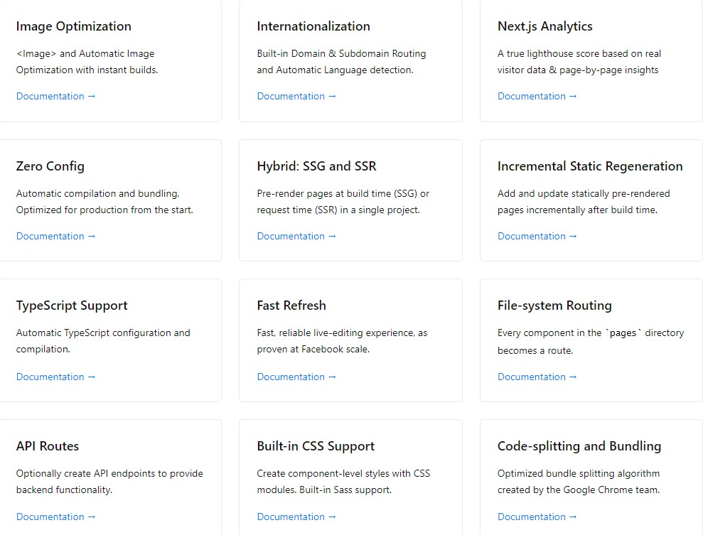

### 1. Next.js 简介

> [The React Framework for Production] Next.js gives you the best developer experience with all the features you need for production: hybrid static & server rendering, TypeScript support, smart bundling, route pre-fetching, and more. No config needed.

一顿牛皮下来，就是 Next.js 在生产和开发环境下都能带给你最佳体验，开箱体验，无需任何配置

### 2. 为什么选择 Next.js

> 老表，咋回事哦，vue 不能满足了吗，搞这玩意干嘛，[vuepress](https://www.vuepress.cn/) 写所谓的静态博客网站不香？香，还比这简单，但请容许我介绍完这个 Next.js


#### 2.1 那 Next.js 有哪些优点呢？

- 图片优化
- 支持国际化
- 零配置
- 支持 SSG + SSR
- 文件系统路由
- 优点太多...



#### 2.2 那 Next.js 比这 vue 和 react 造出来的单页面有何不同？

1. vue 和 react 造出来的单页面应用 SEO 不友好，搜索引擎抓不到 html 的内容，内容都在 js 里
2. vue 和 react 造出来的单页面首屏白屏时间过长，在不对项目 webpack 专门优化的情况下，那个 bundle.js 很大，严重影响体验

**总结**：如果项目对 SEO 要求比较高，建议上 Next 或[Nuxt](https://www.nuxtjs.cn/)

#### 2.3 Next.js 和传统的 php、jsp 有何区别？

> 简单了解

1. 客户端渲染

前后端分离，通过 ajax 进行数据交互，vue 和 react 就是这种模式

2. 服务端模板渲染

php 和 jsp 是解析模板文件，将数据渲染到文件上，最后将模板文件变为 html，生成 html 返回给浏览器，前后端不用同一套代码

3. 前后端同构渲染

也是服务端生成 html 返回给浏览器，区别在于前后端会共用一部分组件代码逻辑，这部分代码既可以用于服务端，也可以用于客户端，而模板渲染是两套代码

### 3. Next.js 主要 api 快速上手

> **注意**：Node.js 版本 12.22.0 起步

#### 3.1 使用`create-next-app`脚手架创建项目

```bash
npx create-next-app@latest
# or
yarn create next-app
```

#### 3.2 项目目录结构

```
│  .eslintrc.json
│  .gitignore
│  next.config.js     # next配置文件
│  package.json
│  README.md
│  yarn.lock
│
├─pages               # 页面路由
│  │  index.js
│  │  _app.js
│  │
│  └─api              # api服务
│          hello.js
│
├─public              # 静态资源
│      favicon.ico
│      vercel.svg
│
└─styles              # css样式
        globals.css   # 全局样式
        Home.module.css
```

#### 3.3 路由

1. 文件系统路由

+ `/pages/index.js` 路径为 `/`
+ `/pages/posts/about.js` 路径为 `/posts/about`
+ `/pages/posts/[id].js` 动态路径为 `/posts/foo` 或者`/posts/bar` 等等

2. Link 组件

> Link 组件会自动执行 prefetch 预加载

```javascript
import Link from "next/link";

export default function Home() {
  return (
    <Link href="/posts/about">
      <a>about page</a>
    </Link>
  );
}

// 或者不用a标签，传参示例
<Link
  href={{
    pathname: "/about",
    query: { name: "test" },
  }}
  passHref
>
  <p>about page</p>
</Link>;
```

3. useRouter

```javascript
import { useRouter } from "next/router";
import { useCallback, useEffect } from 'react';

export default List() {
  const router = useRouter();

  const gotoDetail = useCallback((data) => {
    const { fileName: detailid } = data;

    // https://www.nextjs.cn/docs/api-reference/next/router#with-url-object
    router.push({
      pathname: "/posts/[detailid]",
      query: {
        detailid,
      },
    });
  }, []);

  useEffect(() => {
    // Prefetch the dashboard page
    router.prefetch('/dashboard');
  }, []);

  return (
    <div>
      ...
    </div>
  )
}
```

4. 动态路由

就是`/pages/posts/[id].js`这样的路由

```javascript
import { getAllPostIds, getPostData } from "@/lib/posts";

export async function getStaticPaths() {
  const allListData = await getAllPostIds();
  const paths = allListData.map((item) => {
    return {
      params: { id: item.fileName },
    };
  });

  return {
    paths,
    fallback: false,
  };
}

export async function getStaticProps({ params }) {
  const postData = await getPostData(params.id);

  return {
    props: {
      postData,
    },
  };
}

export default function List({ postData }) {
  // ...
}
```

#### 3.4 Head 组件

> 用于自定义 head 标签内容

```javascript
import Head from "next/head";

export default function Layout({ children }) {
  return (
    <div>
      <Head>
        <meta charSet="UTF-8" />
        <meta
          name="viewport"
          content="width=device-width, initial-scale=1.0, maximum-scale=1.0, user-scalable=0"
        />
        <meta name="keywords" content="Next.js" />
        <meta name="description" content="Next.js" />
        <title>Next.js</title>
      </Head>
      <main>{children}</main>
    </div>
  );
}
```

#### 3.5 Image 组件

> 使用适当的属性，可以大幅优化图像，提升页面渲染

```javascript
import Image from "next/image";

export default function MyImg() {
  return (
    <Image
      className={styles.homeBgImg}
      src={bgImg}
      layout="fill"
      objectFit="cover"
      objectPosition="center"
      quality={65}
      priority={true}
      placeholder="blur"
      blurDataURL={DEFAULT_BASE64}
      alt="img"
    />
  );
}
```

#### 3.6 Script 组件

```javascript
import Script from "next/script";

export default function Home() {
  return (
    <>
      <Script
        src="https://Jquery.js"
        onLoad={() => {
          $.ajax({
            // ...
          });
        }}
      />
    </>
  );
}
```

#### 3.7 CSS

1. CSS Modules（已内置）
2. Sass（已内置）
3. styled-jsx（已内置）
4. [styled-components](https://github.com/vercel/next.js/tree/canary/examples/with-styled-components)（需自行配置）
5. [Tailwind CSS](https://tailwindcss.com/docs/installation/using-postcss)（需自行配置）

#### 3.8 Next.js 的 3 种基本渲染方式

1. Client-side Rendering

> 就是常见的前后端分离

```javascript
import useSWR from "swr";

const fetcher = (url) => fetch(url).then((res) => res.json());

function Profile() {
  const { data, error } = useSWR("/api/user", fetcher);

  if (error) return <div>failed to load</div>;
  if (!data) return <div>loading...</div>;
  return <div>hello {data.name}!</div>;
}
```

2. Static Generation (Recommended)

> 一般以展示一些静态固定数据为主，打包的时候就直接生成，比如博客页面、固定营销页面、帮助文档等

```javascript
import { getAllPostIds } from "@/lib/posts";

export async function getStaticProps() {
  const allListData = await getAllPostIds();

  return {
    props: {
      allListData,
    },
  };
}

export default function List({ allListData }) {
  // ...
}
```

3. Server-side Rendering
   > 以动态数据为主，每次请求的时候都在服务端执行，对服务器压力比较大

```javascript
export async function getServerSideProps(context) {
  return {
    props: {
      list: [...]
    }
  }
}

export default function List({ list }) {
  // ...
}
```

### 4. 部署

#### 4.1 使用 Vercel 快速部署

使用 github 账户注册登录[Vercel](https://vercel.com/)官网，授权访问该仓库，即可快速部署，部署完即可访问。还能看到部署日志。

#### 4.2 部署到自己的服务器

##### 4.2.1 在服务器上进行 docker 镜像制作，然后部署

> 这里服务器以 centos 为例

###### 第 1 步：Dockerfile 文件

1. 使用 Next.js[官方 Dockerfile](https://www.nextjs.cn/docs/deployment#docker-image)

**注意**：如果使用官方 Dockerfile，比如在阿里云上进行部署，会遇到网络问题，下载某些包会很慢，跟你本地访问 github 官网一样，所以要设置国内镜像下载，速度就会变快

```
# Install dependencies only when needed
FROM node:alpine AS deps
# Check https://github.com/nodejs/docker-node/tree/b4117f9333da4138b03a546ec926ef50a31506c3#nodealpine to understand why libc6-compat might be needed.
RUN apk add --no-cache libc6-compat
WORKDIR /app
COPY package.json yarn.lock ./
RUN yarn install --frozen-lockfile

# Rebuild the source code only when needed
FROM node:alpine AS builder
WORKDIR /app
COPY . .
COPY --from=deps /app/node_modules ./node_modules
RUN yarn build && yarn install --production --ignore-scripts --prefer-offline

# Production image, copy all the files and run next
FROM node:alpine AS runner
WORKDIR /app

ENV NODE_ENV production

RUN addgroup -g 1001 -S nodejs
RUN adduser -S nextjs -u 1001

# You only need to copy next.config.js if you are NOT using the default configuration
# COPY --from=builder /app/next.config.js ./
COPY --from=builder /app/public ./public
COPY --from=builder --chown=nextjs:nodejs /app/.next ./.next
COPY --from=builder /app/node_modules ./node_modules
COPY --from=builder /app/package.json ./package.json

USER nextjs

EXPOSE 3000

ENV PORT 3000

# Next.js collects completely anonymous telemetry data about general usage.
# Learn more here: https://nextjs.org/telemetry
# Uncomment the following line in case you want to disable telemetry.
# ENV NEXT_TELEMETRY_DISABLED 1

CMD ["node_modules/.bin/next", "start"]
```

2. 使用自己的 Dockerfile

> 这里可以对 Docker 进行多阶段构建，使打包出来的镜像体积变小

```bash
# 1. 构建基础镜像
FROM alpine:3.15 AS base
#纯净版镜像

ENV NODE_ENV=production \
  APP_PATH=/app

WORKDIR $APP_PATH

# 使用国内镜像，加速下面 apk add下载安装alpine不稳定情况
RUN sed -i 's/dl-cdn.alpinelinux.org/mirrors.aliyun.com/g' /etc/apk/repositories

# 使用apk命令安装 nodejs 和 yarn
RUN apk add --no-cache --update nodejs=16.13.1-r0 yarn=1.22.17-r0

# 2. 基于基础镜像安装项目依赖
FROM base AS install

COPY package.json yarn.lock ./

RUN yarn install

# 3. 基于基础镜像进行最终构建
FROM base

# 拷贝 上面生成的 node_modules 文件夹复制到最终的工作目录下
COPY --from=install $APP_PATH/node_modules ./node_modules

# 拷贝当前目录下的所有文件(除了.dockerignore里排除的)，都拷贝到工作目录下
COPY . .

RUN yarn build

EXPOSE 3000

CMD ["yarn", "start"]
```

###### 第 2 步： 将源代码搞到服务器上

1. 使用`scp`命令手动将本地源代码上传至服务器

```bash
scp -r local_dir root@121.xxx.xxx.xxx:remote_dir
```

2. 或者在远程服务器上`wget`下载 github 源码，然后解压

```bash
wget https://github.com/xxx/main.zip -O main.zip && unzip main.zip -d .
```

3. 使用`xshell`工具上传文件到服务器

上面 3 种方法都可以把本地文件传到服务器对应目录

###### 第 3 步： docker 镜像制作

> 前提是安装好了 docker 并启动

```bash
# 切换都源码目录执行
docker image build -t blog-demo .
```

接着会看到命令行上正在执行镜像制作过程，顺利的话，就成功了


```bash
# 不出意外，可以看到刚才制作的镜像
docker image ls
```

###### 第 4 步： 启动容器

> 前提要在服务器上开好安全组

```
docker container run -d -p 80:3000 -it blog-demo
# -d： 后台运行容器
# -p: 前面80是本机服务器开放端口，后面3000是容器暴露出来的端口
# --name：给容器命名
```

不出意外，容器成功运行。可以在浏览器里进行访问了。

##### 4.2.2 使用`github actions`自动部署

> 上面手动步骤太麻烦了，需要解放双手

这里也可以选择 dockerhub，注册好后，创建仓库，即可推送。阿里云的镜像容器服务，也需要提前开通准备好（命名空间+私人仓库）。

###### 第 1 步：提前准备好

- 容器登录账号+密码
- 服务器的 HOST + 登录账户 + 密码
- 阿里云或者 dockerhub 的镜像容器仓库

###### 第 2 步：github 该仓库 Settings->Secrets 添加秘钥，即上面准备好的这 5 个

> 我这里买的是阿里云的屌丝 1 核 2G 机器，生产环境别这么玩，账号密码可能泄露


###### 第 3 步：项目根目录添加`github yml`配置文件

> .github/workflows/deploy.yml

```bash
name: Docker Image CI

on:
  push: # push 时触发ci
    branches: [main] # 作用于main分支
  # pull_request:
  #   branches: [main]

jobs:
  build:
    runs-on: ubuntu-latest

    steps:
      # 拉取main分支代码
      - name: Checkout
        uses: actions/checkout@v2

      # 制作docker镜像并推送到阿里云容器镜像服务
      - name: build and push docker image
        run: |
          echo ${{ secrets.ALIYUN_DOCKER_PASSWORD }} | docker login registry.cn-hangzhou.aliyuncs.com --username ${{ secrets.ALIYUN_DOCKER_USERNAME }} --password-stdin

          docker image build -t myblog:latest .
          docker tag myblog registry.cn-hangzhou.aliyuncs.com/test-blog/myblog:latest
          docker push registry.cn-hangzhou.aliyuncs.com/test-blog/myblog:latest
          docker logout
      # 登录远程服务器，拉取镜像，制作并重启容器
      # https://github.com/marketplace/actions/remote-ssh-commands
      - name: ssh remote deploy
        uses: fifsky/ssh-action@master
        with:
          command: |
            cd /
            echo -e "1.docker login start==>"
            echo ${{ secrets.ALIYUN_DOCKER_PASSWORD }} | docker login registry.cn-hangzhou.aliyuncs.com --username ${{ secrets.ALIYUN_DOCKER_USERNAME }} --password-stdin

            echo -e "2.docker stop myblog container==>"
            docker container stop myblog

            echo -e "3.docker conatainer rm==>"
            docker container rm myblog

            echo -e "4.docker image rm==>"
            docker image rm registry.cn-hangzhou.aliyuncs.com/test-blog/myblog:latest

            echo -e "5.docker pull==>"
            docker pull registry.cn-hangzhou.aliyuncs.com/test-blog/myblog:latest

            echo -e "6.docker container create and start==>"
            docker container run -d -p 80:3000 --name myblog registry.cn-hangzhou.aliyuncs.com/test-blog/myblog:latest

            echo -e "7.docker logout==>"
            docker logout
          host: ${{ secrets.HOST }}
          user: ${{ secrets.USER }}
          pass: ${{ secrets.PASSWORD }}

```

###### 第 4 步：提交代码，自动部署

> 不出意外，在仓库的 Actions 里看到一切 ok

```
git add .
git commit -m "chore: add github actions yml"
git push -u origin main
```


[当前博客点击预览](https://nextjs-blog-nine-delta-65.vercel.app/)


### 5. 参考资料

1. [Next.js 官方文档](https://nextjs.org/docs/getting-started)

2. [如何优化 node 项目的 docker 镜像](https://juejin.cn/post/6991689670027542564)

3. [Docker 入门教程](http://www.ruanyifeng.com/blog/2018/02/docker-tutorial.html)

4. [前后端同构和模板渲染的区别是什么呢？](https://www.zhihu.com/question/379598562)

5. [手把手教你用 Github Actions 部署前端项目](https://juejin.cn/post/6950799922178310152)
