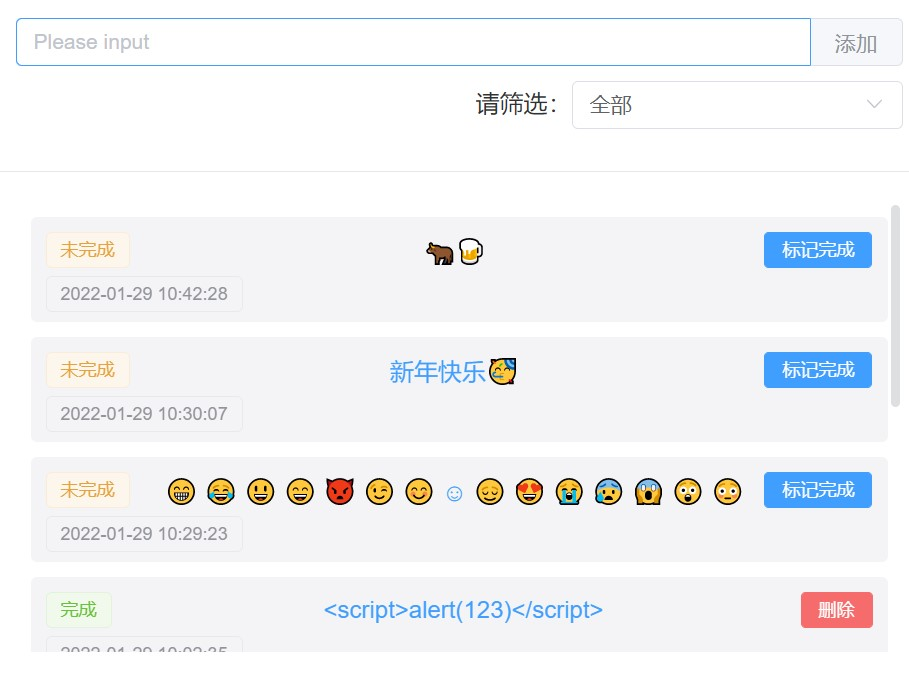
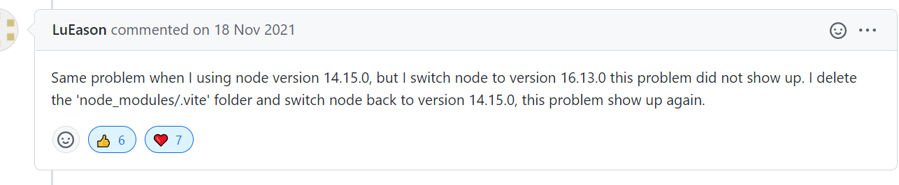
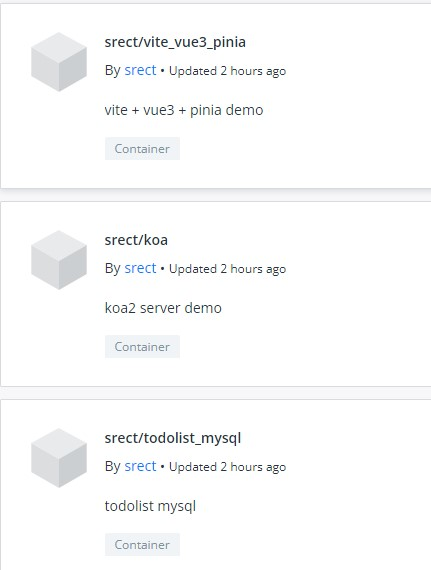
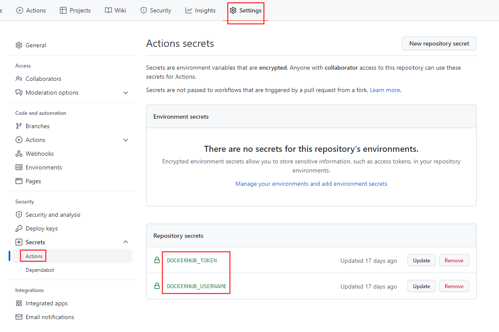
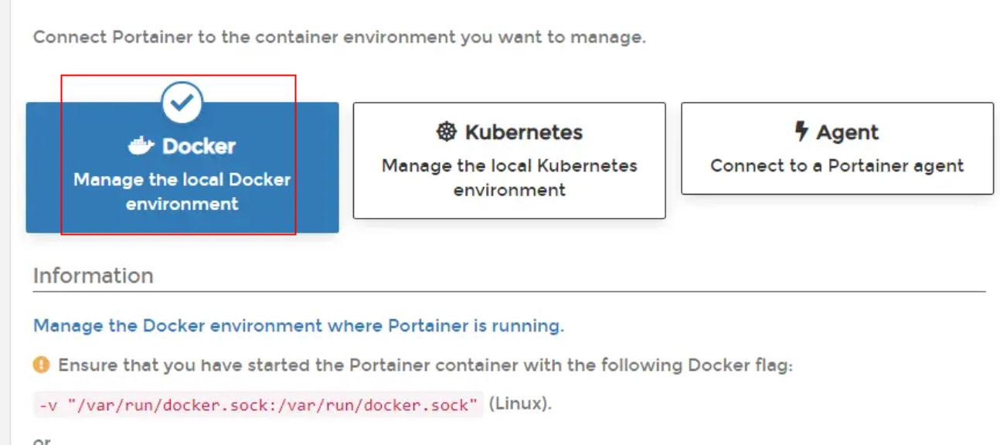
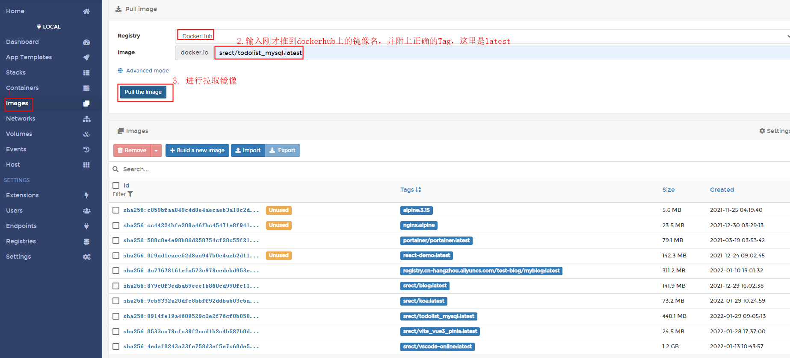
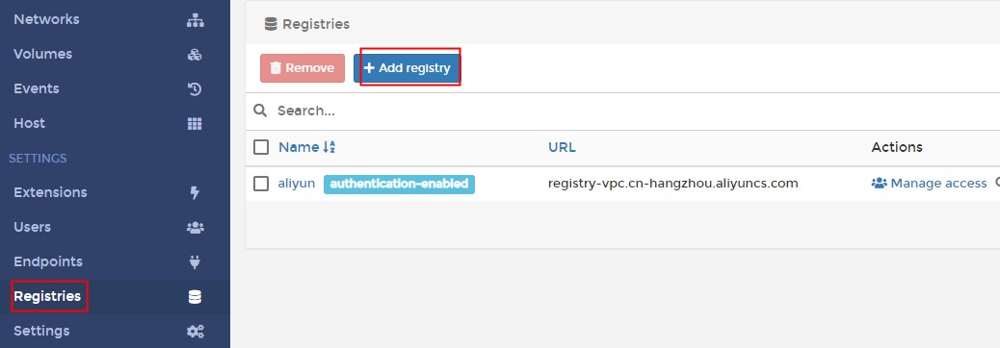
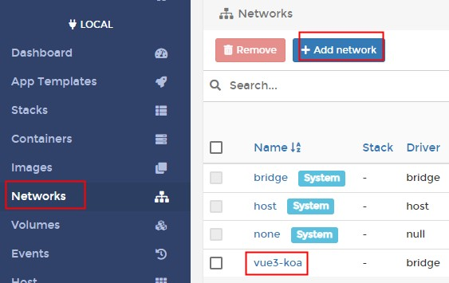
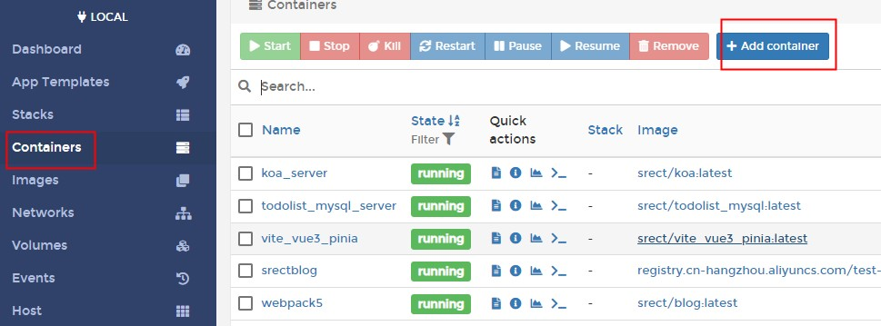
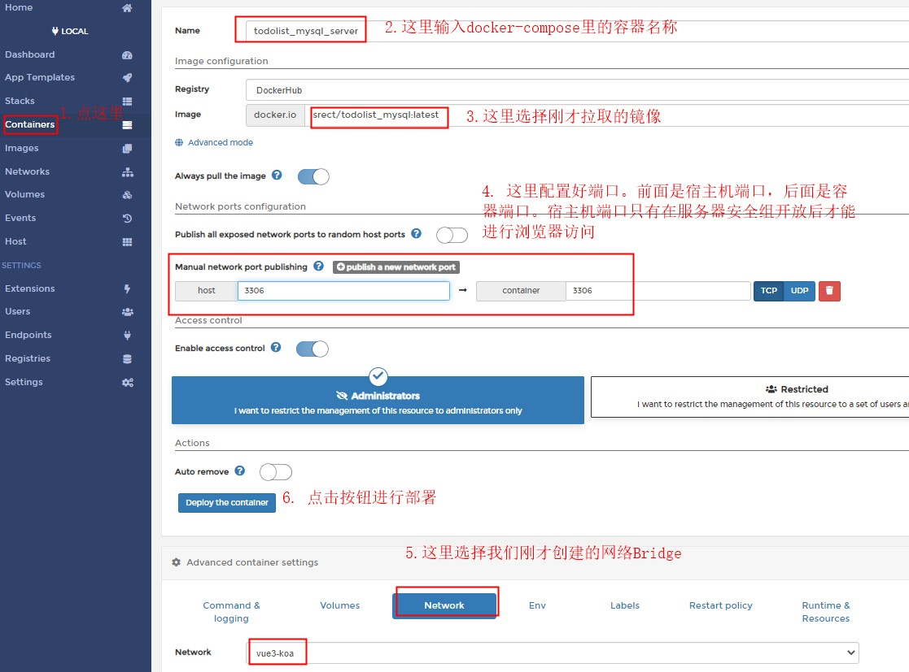

- [项目线上预览](http://121.199.8.71:8001/)
- [github 源码仓库](https://github.com/sRect/docker-compose)

文章里很多都是配置，可以直接先直接复制过去使用，或者直接下载源代码运行，先跑通项目。

### 1. 主要 package version 和提前准备

1. package version

|  package  | version |
| :-------: | :-----: |
|    koa    | ^2.13.4 |
| sequelize | ^6.14.1 |
|   vite    | ^2.7.13 |
|    vue    | ^3.2.25 |
|   pinia   | ^2.0.6  |

2. 提前准备

- 1 台线上服务器，百度云、阿里云等等，并安装好 docker(教程自行搜索，很简单)。没有的用本地虚拟机代替，自行研究
- 注册一个 dockerhub 账户，有阿里云服务器的会自带容器镜像服务可以用，可以不用注册 dockerhub
- 注册一个 github 账户，并创建一个仓库。文章以 github 为例，gitee 的自行研究

### 2. 项目目录解构

> 项目目录结构简单，前端应用放在`web`目录内，数据库放在`mysql`目录内，其它的是后台`koa`应用

```
├── docker-compose.yml  # docker-compose配置文件
├── Dockerfile # 后台koa的容器镜像配置文件
├── log # 日志存储
|  ├── access.log-2022-01-28.log
|  ├── application.log-2022-01-28.log
|  └── mysql.log-2022-01-28.log
├── middleware # koa中间件
|  ├── handleGlobalError.js
|  ├── index.js
|  └── logClientDevices.js
├── mysql # mysql配置文件
|  ├── create_db.sql # 创建数据库sql
|  ├── Dockerfile # mysql的容器镜像配置文件
|  ├── initial_data.sql # 初始化数据表sql
|  ├── privileges.sql # 修改mysql账号权限密码
|  └── setup.sh # 容器启动执行的shell
├── package-lock.json
├── package.json
├── public # koa-static静态文件配置目录
|  ├── favicon.ico
|  └── index2.html
├── README.md
├── routes # @koa/router的接口路由
|  ├── todoList.js
|  └── uuid.js
├── server.js # koa的启动文件
├── util
|  ├── db.js # mysql连接配置
|  └── logger.js # koa-log4的日志配置
└── web # vue前端应用
    ├── Dockerfile
    ├── index.html
    ├── nginx.conf
    ├── package.json
    ├── public
    ├── README.md
    ├── src
    |  ├── App.vue
    |  ├── assets
    |  ├── components
    |  ├── main.js
    |  ├── services # 接口
    |  └── store # Pinia状态管理
    ├── vite.config.js
    └── yarn.lock
```

### 3. 前端部分

> 当然要用最近炒的火热的 Pinia 状态管理 + vue3 来写 todolist 应用了



#### 3.1 [Pinia 状态管理快速上手](https://pinia.esm.dev/introduction.html#a-more-realistic-example)，对着文档开撸

```javascript
// src/store/index.js
import { defineStore } from "pinia";
import * as types from "./types";

export const useTodosStore = defineStore("todos", {
  state: () => ({
    /** @type {{ msg: string, id: string, is_finished: boolean, create_time: date }[]} */
    todos: [],
    filter: types.ALL,
    nextId: 0,
  }),
  getters: {
    finishedTodos(state) {
      return state.todos.filter((todo) => todo.is_finished);
    },
    unfinishedTodos(state) {
      return state.todos.filter((todo) => !todo.is_finished);
    },
    filterTodos(state) {
      if (this.filter === types.FINISHED) {
        return this.finishedTodos;
      } else if (this.filter === types.UNFINISHED) {
        return this.unfinishedTodos;
      }

      return this.todos;
    },
  },
  actions: {
    addTodos({ id, msg, create_time }) {
      this.todos.unshift({ id, msg, create_time, is_finished: false });
    },
    finishedOneTodo(obj) {
      const index = this.todos.findIndex((item) => item.id === obj.id);
      this.todos.splice(index, 1, {
        ...obj,
        is_finished: true,
      });
    },
    deleteOne(id) {
      this.todos = this.todos.filter((item) => item.id !== id);
    },
    setInitialData(arr) {
      this.todos = [...arr];
    },
  },
});
```

#### 3.2 关于 vite+element-plus 启动报错 error while updating dependencies

报错部分：

```
上午11:02:22 [vite] new dependencies found: element-plus/es, element-plus/es/components/option/style/css, updating...
上午11:02:22 [vite] Failed to load source map for /node_modules/.vite/chunk-TPOPRDHF.js?v=e12284c2.
 > error: Failed to write to output file: open D:\my\resource\Vue.js\vue3+Pinia\node_modules\.vite\element-plus.js: Access is denied.

上午11:02:37 [vite] error while updating dependencies:
Error: Build failed with 1 error:
error: Failed to write to output file: open D:\my\resource\Vue.js\vue3+Pinia\node_modules\.vite\element-plus.js: Access is denied.
    at failureErrorWithLog (D:\my\resource\Vue.js\vue3+Pinia\node_modules\esbuild\lib\main.js:1493:15)
    at D:\my\resource\Vue.js\vue3+Pinia\node_modules\esbuild\lib\main.js:1151:28
    at runOnEndCallbacks (D:\my\resource\Vue.js\vue3+Pinia\node_modules\esbuild\lib\main.js:941:63)
    at buildResponseToResult (D:\my\resource\Vue.js\vue3+Pinia\node_modules\esbuild\lib\main.js:1149:7)
    at D:\my\resource\Vue.js\vue3+Pinia\node_modules\esbuild\lib\main.js:1258:14
    at D:\my\resource\Vue.js\vue3+Pinia\node_modules\esbuild\lib\main.js:629:9
    at handleIncomingPacket (D:\my\resource\Vue.js\vue3+Pinia\node_modules\esbuild\lib\main.js:726:9)
    at Socket.readFromStdout (D:\my\resource\Vue.js\vue3+Pinia\node_modules\esbuild\lib\main.js:596:7)
    at Socket.emit (events.js:400:28)
    at addChunk (internal/streams/readable.js:290:12)
```

一番折腾（又是删除 node_modules 重新 install 安装，又是升级依赖到最新版本，又是检查文件夹路径有无中文...）过后，找到了[解决方法](https://github.com/nuxt/vite/issues/207#issuecomment-972655272)：



升级 Node.js 到最新版本（当前最新版本为 16.13.2），删掉 node_modules 文件夹，重新安装依赖，启动正常

如果你使用 nvm，可以这样快捷升级 nodejs

```bash
nvm install 16.13.2
nvm use 16.13.2
```

#### 3.3 nginx.conf

```conf
server {
    listen  80; #配置监听端口
    charset utf-8;

    #charset koi8-r;
    #access_log  /var/log/nginx/host.access.log  main;

    location ~ /api/ { # 配置跨域转发
        # 注意这里的配置代理名称为docker-compose中koa容器的名称
        proxy_pass  http://koa_server:4000;
        # rewrite ^/api/(.*)$ /$1 break;
        proxy_set_header Host $host;
        proxy_set_header X-Real-IP $remote_addr;
        proxy_set_header X-Forwarded-For $proxy_add_x_forwarded_for;
        client_max_body_size 100m;
    }

    location / {
        root   /usr/share/nginx/dist; #服务默认启动目录
        index  index.html index.htm; #默认访问文件
        try_files $uri /index.html; # 防止浏览器刷新后，页面404
        client_max_body_size 100m;
    }

    location =/admin {
        deny all; #admin目录禁止任何人访问
    }

    location ~\.java$ {
        deny all; #匹配所有java文件禁止访问
    }

    error_page   500 502 503 504  /50x.html; #错误状态的显示页面，配置后需重启
    error_page 404 /404.html; #404页面
    location = /50x.html {
        root   /usr/share/nginx/html;
    }

    gzip on; #开启gzip
    gzip_buffers 32 4k; #设置压缩所需要的缓冲区大小，以4k为单位，如果文件为32k则申请32*4k的缓冲区
    gzip_comp_level 6; #gzip 压缩级别，1-9，数字越大压缩的越好，也越占用CPU时间
    gzip_min_length 4000; #gizp压缩起点，文件大于4k才进行压缩
    gzip_vary on; # 是否在http header中添加Vary: Accept-Encoding，建议开启
    gzip_static on; #nginx对于静态文件的处理模块，开启后会寻找以.gz结尾的文件，直接返回，不会占用cpu进行压缩，如果找不到则不进行压缩
    gzip_types text/xml text/javascript application/javascript text/css text/plain application/json application/x-javascript; # 进行压缩的文件类型
}
```

#### 3.4 Dockerfile

> 使用多阶段构建，减少容器体积

```Dockerfile
FROM alpine:3.15 AS base
ENV NODE_ENV=production \
  APP_PATH=/app
WORKDIR $APP_PATH
# 使用apk命令安装 nodejs 和 yarn
RUN apk add --no-cache --update nodejs=16.13.2-r0 yarn

FROM base AS install
COPY package.json yarn.lock $APP_PATH/
RUN yarn install

FROM base AS build
# 拷贝上面生成的 node_modules 文件夹复制到最终的工作目录下
COPY --from=install $APP_PATH/node_modules $APP_PATH/node_modules
# 拷贝当前目录的文件到工作目录(除了.dockerignore中忽略的)
COPY . $APP_PATH/
RUN yarn run build

FROM nginx:alpine
WORKDIR /usr/share/nginx/dist
# 添加自己的配置 default.conf 在下面
ADD nginx.conf /etc/nginx/conf.d/default.conf
COPY --from=build /app/dist .
EXPOSE 80
```

### 4. 后台部分

#### 4.1 入口文件

```javascript
// server.js
const path = require("path");
const Koa = require("koa");
const Router = require("@koa/router");
const ROOT = path.resolve(process.cwd(), "./");
const { connectMySQL } = require(path.resolve(ROOT, "./util/db"));
const todoList = require(path.resolve(ROOT, "./routes/todoList"));

const app = new Koa();
const router = new Router();

// 加载所有子路由
router.use("/api", todoList.routes(), todoList.allowedMethods());
// 加载路由中间件
app.use(router.routes()).use(router.allowedMethods());

app.listen(4000, async () => {
  await connectMySQL();
});
```

#### 4.2 [sequelize 连接 mysql 数据库](https://github.com/demopark/sequelize-docs-Zh-CN/blob/master/core-concepts/getting-started.md)

```javascript
// util/db.js
const path = require("path");
const { Sequelize } = require("sequelize");

const db = new Sequelize("todolist", "root", "123456", {
  dialect: "mysql",
  dialectOptions: {
    charset: "utf8mb4",
    collate: "utf8mb4_unicode_ci",
    supportBigNumbers: true,
    bigNumberStrings: true,
  },
  // 这里的host，线上指向docker-compose中mysql的容器名
  host:
    process.env.NODE_ENV === "development"
      ? "localhost"
      : "todolist_mysql_server",
  timezone: "+08:00", // 东8区
  port: "3306",
});

const connectMySQL = async () => {
  try {
    await db.authenticate();
    console.log("mysql连接成功");
  } catch (e) {
    console.log(e);
    console.log("连接失败，3秒后重试");
    setTimeout(connectMySQL, 3000);
  }
};

exports.connectMySQL = connectMySQL;
exports.db = db;
```

#### 4.3 接口示例

```javascript
// routes/todolist.js
const Router = require("@koa/router");
const dayjs = require("dayjs");
const utc = require("dayjs/plugin/utc"); // dependent on utc plugin
const timezone = require("dayjs/plugin/timezone");
const { QueryTypes } = require("sequelize");

const ROOT = path.resolve(process.cwd(), "./");
const { db } = require(path.resolve(ROOT, "./util/db"));

const todoList = new Router();
// https://dayjs.gitee.io/docs/zh-CN/plugin/timezone
dayjs.extend(utc);
dayjs.extend(timezone);
dayjs.tz.setDefault("Asia/Shanghai");

// 列表查询
todoList.get("/todoList/list", async (ctx, next) => {
  const reqParams = ctx.query;
  // https://github.com/demopark/sequelize-docs-Zh-CN/blob/master/core-concepts/getting-started.md#promises-%E5%92%8C-asyncawait

  const selects = {
    0: "SELECT * FROM todolist WHERE is_finished='0' ORDER BY create_time DESC;",
    1: "SELECT * FROM todolist WHERE is_finished='1' ORDER BY create_time DESC;",
    2: "SELECT * FROM todolist ORDER BY create_time DESC;",
  };

  const filterType = reqParams.filterType || "2";

  try {
    let list = await db.query(selects[filterType], {
      type: QueryTypes.SELECT,
    });

    list = list.map((item) => ({
      ...item,
      create_time: dayjs(item.create_time)
        .tz("Asia/Shanghai")
        .format("YYYY-MM-DD HH:mm:ss"),
      is_finished: item.is_finished === "0" ? false : true,
    }));

    ctx.body = {
      code: 200,
      data: list || [],
      msg: "ok",
    };
  } catch (e) {
    console.log(e);
  }

  await next();
});

module.exports = todoList;
```

#### 4.4 Dockerfile

```Dockerfile
FROM alpine:3.15 AS base

ENV NODE_ENV=production \
  APP_PATH=/www/node-server

WORKDIR $APP_PATH

# 使用apk命令安装 nodejs
RUN apk add --no-cache --update nodejs=16.13.2-r0 npm

# 基于基础镜像安装项目依赖
FROM base AS install

# 将当前目录的package.json 拷贝到工作目录下
COPY package.json package-lock.json $APP_PATH/

RUN npm install

# 基于基础镜像进行最终构建
FROM base

# 拷贝 上面生成的 node_modules 文件夹复制到最终的工作目录下
# COPY命令复制文件夹的时候，不是直接复制该文件夹，而是将文件夹中的内容复制到目标路径
COPY --from=install $APP_PATH/node_modules $APP_PATH/node_modules
# 拷贝当前目录的文件到工作目录(除了.dockerignore中忽略的)
COPY . $APP_PATH/

EXPOSE 4000

CMD ["npm", "run", "server"]
```

#### 4.5 注意事项

- 数据库连接配置时区`timezone`，设置为东 8 区
- 设置数据库字符集为`utf8mb4`，方便后面存储表情符
- `dayjs`库调整显示为东 8 区时间
- `sequelize`查询出来有重复项(非数据库里的数据重复)，需要配置`type`为`QueryTypes.SELECT`

### 5. MySQL 部分

> 这里选择的版本为**5.7.30**版本，线上 8.0 版本未部署成功

#### 5.1 mysql/Dockerfile

```Dockerfile
FROM mysql:5.7.30

LABEL version="1.0.0" description="todolist MySQL 服务器"
WORKDIR /mysql

ENV MYSQL_ROOT_PASSWORD=123456
# MYSQL_DATABASE=todolist
# MYSQL_ALLOW_EMPTY_PASSWORD=yes

# 启动脚本
COPY setup.sh /mysql/setup.sh
# 创建数据库
COPY create_db.sql /mysql/create_db.sql
# 初始化数据
COPY initial_data.sql /mysql/initial_data.sql
# 设置密码和权限
COPY privileges.sql /mysql/privileges.sql

EXPOSE 3306

CMD ["sh", "/mysql/setup.sh"]
```

#### 5.2 `mysql/setup.sh`容器启动脚本

```bash
#!/bin/bash
set -e
# https://xie.infoq.cn/article/a3c8ffbd34d818de010f2b0f6
# 打印mysql服务的状态
echo $(service mysql status)

echo '1.启动mysql...'
#启动mysql
# service mysql stop
# service mysql restart
service mysql start

# sleep 3
echo '2.创建数据库...'
mysql </mysql/create_db.sql
sleep 3

echo '3.开始导入数据...'
mysql </mysql/initial_data.sql

sleep 3
echo $(service mysql status)

echo '4.修改mysql权限...'
mysql </mysql/privileges.sql
sleep 3
echo '4.权限修改完毕...'

# 防止container启动后退出
# http://www.mayanpeng.cn/archives/121.html
tail -f /dev/null
```

#### 5.3 `mysql/create_db.sql`创建数据库

```sql
CREATE DATABASE IF NOT EXISTS todolist;
```

#### 5.4 `mysql/initial_data.sql`初始化表

```sql
-- 使用todolist库
USE todolist;

-- 创建todolist表
CREATE TABLE IF NOT EXISTS todolist(id VARCHAR(50) PRIMARY KEY, create_time DATETIME UNIQUE, is_finished ENUM('0', '1') DEFAULT '0', msg VARCHAR(100) DEFAULT '--') COMMENT='todolist表' ENGINE=InnoDB DEFAULT CHARSET=utf8;

-- 打印数据库
SHOW TABLES;

-- 打印表结构
DESC todolist;

-- 插入1条默认数据
INSERT INTO todolist(id, create_time, is_finished, msg) VALUES(1, NOW(), '0', 'hello world');
```

#### 5.5 `mysql/privileges.sql`设置权限密码

```sql
use mysql;
SELECT host, user FROM user;

-- 将数据库的权限授权给root用户，密码为123456
GRANT ALL PRIVILEGES ON *.* TO 'root'@'%' IDENTIFIED BY '123456';

-- 刷新权限这一条命令一定要有：
flush privileges;
```

### 6 部署准备

#### 6.1 提前准备好

1. 在`dockerhub`账号或者`阿里云镜像容器服务`创建 3 个仓库，分别放 mysql、koa、vue 应用，我这里创建的是`todolist_mysql`、`koa`和`vite_vue3_pinia`，在下面的 docker-compose.yml 配置文件中一一对应
   

2. 在你的`github`仓库里里配置好上面 dockerhub 的账号和密码`secrets`，方便于后面使用 github 仓库的 actions 推送。我这里创建的是`DOCKERHUB_TOKEN`放密码，`DOCKERHUB_USERNAME`放账户
   

#### 6.2 `docker-compose.yml`

```yml
version: "3"
services:
  mysql: # mysql
    build: ./mysql
    # image名称为在dockerhub里创建好的名称
    image: 你的docker账户名/todolist_mysql:latest
    container_name: todolist_mysql_server
    restart: always
    # MYSQL_ROOT_PASSWORD: "123456"

  node: # nodejs服务
    depends_on:
      - "mysql"
    build: . # Dockerfile所在目录构建
    image: 你的docker账户名/koa:latest
    container_name: koa_server
    # ports:
    #   - "8001:4000"
    restart: always # 自动重启
    environment:
      - NODE_ENV=production
    command: npm run server # 覆盖容器启动后默认执行的命令

  vue:
    depends_on: # vue 容器会保证在 node容器之后启动
      - "node"
    build: ./web
    image: 你的docker账户名/vite_vue3_pinia:latest
    container_name: vite_vue3_pinia
    restart: always
    environment:
      - NODE_ENV=production
    ports:
      - "8001:80"

networks:
  default:
    external:
      name: vue3-koa
```

#### 6.3 github ci 配置文件

```yml
# .github/workflows/ci.yml
name: MySQL + Koa2 Server + Vue3 todolist

on:
  push:
    branches: [main] # 监听main分支

jobs:
  build:
    runs-on: ubuntu-latest

    steps:
      - name: Checkout
        uses: actions/checkout@v2

      # 制作docker镜像并推送到dockerhub
      - name: build and push docker image
        run: |
          # 这里用到上面创建的secrets变量
          # 登录你的docker账号
          docker login -u ${{ secrets.DOCKERHUB_USERNAME }} -p ${{ secrets.DOCKERHUB_TOKEN }}
          # 进行docker镜像制作
          docker-compose build
          # 推送到你的docker账户里
          docker-compose push
          # 退出登录
          docker logout
```

#### 6.4 提交代码

> 等不及了，是时候进行提交代码了

```bash
git add .

git commit -m "feat: init"

git push -u origin main
```

不出意外，在仓库的`Actions`里看到构建成功。


### 7. `Portainer`出场

> 费了这么大劲，todolist 还没看到，是我的错，最后一步了，别放弃。

#### 7.1 Portainer 的好处

这就如同 git，使用 git GUI 工具和 git bash 命令行其他一样，方便容器管理操作。如果你喜欢命令行，就直接跳过这一节，直接部署容器吧。

把 git 仓库代码下载到服务器，`docker compose up`即可解决战斗！

#### 7.2 登录你的服务器安装[portainer](https://hub.docker.com/r/portainer/portainer)，我这里之前安装的 1.24.2 版本

> 前提是在你的服务器上安装好 docker

1. 下载

```shell
docker pull portainer/portainer:latest
```

2. 运行

> 注意： 这里你的服务器的安全组要开放 9000 端口

```
docker run -d -p 9000:9000 -v /var/run/docker.sock:/var/run/docker.sock --restart=always --name prtainer portainer/portainer
```

#### 7.3 portainer 实操

浏览器里打开`http://你的服务器公网ip:9000`,设置好账户和密码，进行登录，并且设置本地节点



#### 7.3.1 拉取刚才推到 dockerhub 的镜像

> 刚才那 3 个镜像都要拉取



如果是推到阿里云镜像容器的，点击左侧菜单 Registry，然后进去点击 Add registry 添加你的镜像容器 url，同时可以配置`Authentication`,你的账号和密码，然后就可以和上面一样 pull 镜像了



#### 7.3.2 设置容器 NetWork，进行容器通信

> 我受不了，到底还有多少步，你骗我。真的马上结束了

实质是使用了 `docker network`，然后再把自己的容器添加到这个 network 中来

```bash
docker network create 自定义bridge名称
docker network connect 自定义bridge名称 容器名称
```

这里我们用图形化界面操作



#### 7.3.3 部署容器

> 我真的受不了了，还没结束啊，这次真的结束了

点击 container 添加容器。这里必须和 docker-compose 中的顺序一样，先部署 MySQL，再部署 Koa，最后部署 vue 应用



进行部署配置，按顺序部署完 3 个容器，容器名称和端口必须都得和配置文件中的一样



#### 7.3.4 阿弥陀佛

> xdm，真的结束了，是我折磨你了。一切顺利的话，3 个容器都部署成功

打开浏览器访问你的 todolist, `http://你的ip:8001`

#### 7.3.5 关于保存 emoji 失败

> 因为前面创建表的时候，msg 列没有使用`utf8mb4`字符集。那为什么不在建表的时候就设置好，我错了，xdm，揍我吧

> 觉得复杂难受的，直接跳过

**docker 进入容器实战**

前提是登录你的服务器

1. 查看运行的容器

```shell
docker container ls
```

2. 进入容器

```bash
docker exec -it 上面mysql容器的CONTAINER ID sh
```

3. 连接 mysql

```shell
mysql -h localhost -u root -p
# 然后输入设置的密码
```

不出意外，我们成功进入容器内，并连接上了 mysql

```
[root@iZbp19ftqv2b85av0b2d4qZ /]# docker exec -it a206f021c205 sh
# mysql -h localhost -u root -p
Enter password:
Welcome to the MySQL monitor.  Commands end with ; or \g.
Your MySQL connection id is 53
Server version: 5.7.30 MySQL Community Server (GPL)

Copyright (c) 2000, 2020, Oracle and/or its affiliates. All rights reserved.

Oracle is a registered trademark of Oracle Corporation and/or its
affiliates. Other names may be trademarks of their respective
owners.

Type 'help;' or '\h' for help. Type '\c' to clear the current input statement.

mysql>
```

4. 修改 todolist 表的 msg 列属性

- 使用 todolist 库

```sql
USE todolist;
```

- 进行修改

```sql
mysql> ALTER TABLE todolist MODIFY msg VARCHAR(100) character set utf8mb4 collate utf8mb4_unicode_ci default '--';
Query OK, 6 rows affected (0.04 sec)
Records: 6  Duplicates: 0  Warnings: 0
```

- 验证是否修改成功

> 可以看到，msg 列已经修改成功了

```sql
mysql> SHOW CREATE TABLE todolist\G
*************************** 1. row ***************************
       Table: todolist
Create Table: CREATE TABLE `todolist` (
  `id` varchar(50) NOT NULL,
  `create_time` datetime DEFAULT NULL,
  `is_finished` enum('0','1') DEFAULT '0',
  `msg` varchar(100) CHARACTER SET utf8mb4 COLLATE utf8mb4_unicode_ci DEFAULT '--',
  PRIMARY KEY (`id`),
  UNIQUE KEY `create_time` (`create_time`)
) ENGINE=InnoDB DEFAULT CHARSET=utf8 COMMENT='todolist表'
1 row in set (0.00 sec)
```

- 浏览器里输入 emoji 表情符添加测试，不出意外，已经 ok。结束了！！！

### 8. 参考资料

1. [使用 Portainer 部署 Docker 容器实践](https://segmentfault.com/a/1190000039803577)

2. [MySql 的 Dockerfile 编写](https://xie.infoq.cn/article/a3c8ffbd34d818de010f2b0f6)

3. [Pinia 文档](https://pinia.esm.dev/introduction.html#a-more-realistic-example)

4. [sequelize 中文文档](https://github.com/demopark/sequelize-docs-Zh-CN)

5. [dayjs](https://dayjs.gitee.io/zh-CN/)

6. [【实战】Node 服务中如何写日志？](https://juejin.cn/post/7045999468843368462)
