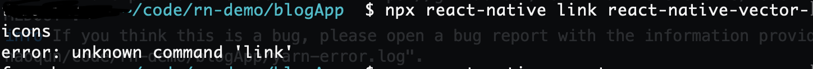
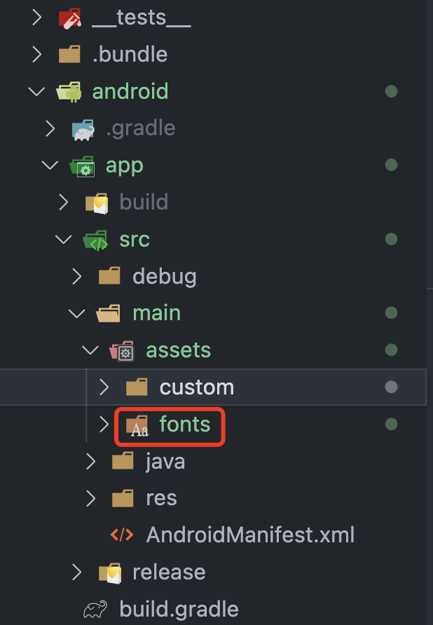
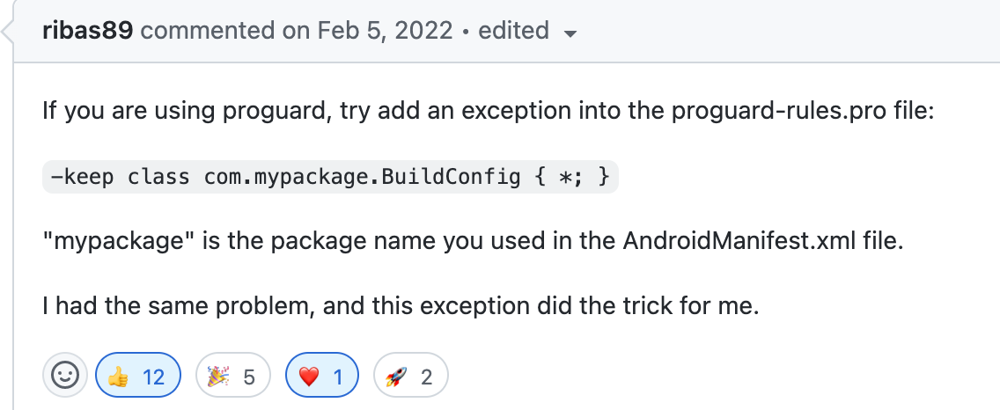

# React Native 练习时长 2 月半，踩坑总结

- [本文 github 仓库链接](https://github.com/sRect/reactNativeBlogApp)
- [本文掘金链接](https://juejin.cn/post/7234407587118530597)

> 本文用 react native 做的 app 很简单，首页 + 列表页 + 详情页 + 关于页。总的感觉，涉及到原生方面，对于不会 android 和 ios 的 js 菜鸡，比较棘手，要折腾。


> 关于Headless JS后台任务，可以参考《React Native Android 端Headless JS后台 GPS 持续定位》这篇文章

## 1. 前置基础

1. React 基础
2. [React Native 文档](https://www.reactnative.cn/)

## 2. 本文主要 package version

> 1. 这里页面路由应该使用 [`react-navigation`](https://reactnavigation.org/docs/getting-started) 更方便些，react-router-native6.x 版本感觉对 react native 支持不是很好
> 2. 对于 UI 库，没找到合适的，找了一个老掉牙的[`ant-design-react-native`](https://rn.mobile.ant.design/docs/react/introduce-cn)

| package                  | version  |
| ------------------------ | :------: |
| react                    |  18.2.0  |
| react-native             |  0.71.2  |
| react-router-native      |  ^6.8.0  |
| react-native-webview     | ^11.26.1 |
| @ant-design/react-native |  ^5.0.3  |

## 3. 关于 React Native 的一些疑问

### 3.1 React Native 和 Flutter 优缺点对比

> 来自 chat gpt 的回答，感觉有些落后啊

|              |                                                          优点                                                           | 缺点                                                                                                                                    |
| ------------ | :---------------------------------------------------------------------------------------------------------------------: | --------------------------------------------------------------------------------------------------------------------------------------- |
| React Native |   1. 拥有大量第三方库和社区支持；<br>2. 可以复用 React 的开发经验,语法上非常接近 React；<br> 3. 支持热重载,开发效率高   | 1. 部署和打包过程较复杂；<br>2. 动画和性能体验略逊色于原生；<br>3. 升级过程可能会比较痛苦                                               |
| Flutter      | 1. 组件丰富,UI 体验接近原；<br>2. 性能很高,特别是动画方面；<br> 3. 打包简单,可以编译成原生代码；<br>4. 升级过程比较顺畅 | 1. 第三方库和社区还在发展,不如 React Native 成熟 ；<br>2. 对 Dart 语言的依赖,有一定学习成本；<br> 3. 热重载不能像 React Native 一样方便 |

### 3.2 如何看待 react native 到目前为止，还没出 1.0 版本？

> 同样来自 chat gpt 的回答

React Native 虽然至今还没发布 1.0 版本,但这不意味着它不成熟或不可用。

1. Facebook 的版本发布策略是非常慢慢的,要达到 1.0 需要非常稳定和完善,这需要长期的迭代和磨合。
2. React Native 生态庞大,涉及的平台和版本组合非常多,要保证在所有环境下 100% 稳定并不容易。
3. React Native 的升级过程中,会涉及到原生代码的迁移,这也增加了版本发布的难度。
4. 社区提供的第三方库也需要跟上版本迭代,这需要协调和校准,也是版本发布的阻碍。

### 3.3 react native 使用的是原生 view 还是 webview?

> 同样来自 chat gpt 的回答

- React Native 使用的是原生 View 而不是 WebView
- React Native 的核心思想是使用 JavaScript 来开发移动应用,而不是 Web 应用。它允许你使用 React 来开发原生移动应用,最终编译成真实的原生 UI 元素
- 具体来说,React Native 将 React 组件映射到原生 View 和 Text 组件上,而不是 WebView。所以当你在 JavaScript 中构建一个 Button 时,在本质上它会变成 Android 的 Button 或 iOS 的 UIButton。

## 4. 开发环境准备

> 本文选择了本地搭建环境，没有选择依赖线上的 expo 沙盒环境

[本地环境搭建文档](https://www.reactnative.cn/docs/environment-setup)，对着文档一步步来即可

1. 创建项目

```
npx react-native init AwesomeProject
```

2. 使用安卓手机调试

> 也可以使用模拟器，由于我手机是安卓的，就用了安卓手机。还有就是安卓模拟器上的显示和真机有些差距，问题没及时暴露。

手机打开开发者模式，并打开 usb 调试，数据线连接电脑即可，运行项目的时候，会自动在你的手机上安卓 debug 安装包

## 5. 开发时遇到的一些问题总结

### 5.1 安装第三方 ui 库，link 字体时报错

> 根据 Ant Design Mobile RN of React 文档[链接字体图标](https://rn.mobile.ant.design/docs/react/introduce-cn)，安装完`@ant-design/icons-react-native`库后，需要执行`npx react-native link @ant-design/icons-react-native`，然后出现如下报错



**解决：**

1. 安装 `react-native-asset`

```
yarn add react-native-asset --save
```

2. 根目录 react-native.config.js，assets 添加字体图标文件的路径

```
module.exports = {
  assets: ['node_modules/@ant-design/icons-react-native/fonts']
};
```

3. 执行 yarn react-native-asset

```
yarn react-native-asset
```

4. 检查是否链接成功，android\app\src\main\assets 下是否有 fonts 文件夹



5. 关于项目中使用了[@dr.pogodin/react-native-static-server
](https://github.com/birdofpreyru/react-native-static-server#bundling-in-server-assets-into-an-app-statically)

感谢 @小白菜 大佬的提供，`react-native-static-server`是一款可以在react native中，本地启动静态服务的库，文档中有提到`android/app/build.gradle`配置：

```
android {
  sourceSets {
    main {
      assets.srcDirs = [
        '../../assets'
        // This array may contain additional asset folders to bundle-in.
        // Paths in this array are relative to "build.gradle" file, and
        // should be comma-separated.
      ]
    }
  }
  // ... Other stuff.
}
```

这样配置过后，会导致`@ant-design/icons-react-native`字体无法正确加载。如果app内有其它静态资源，在配置assets.srcDirs的时候需要把 `=` 换成 `+=`，这样就可以加载字体图标了：

```diff
android {
  sourceSets {
    main {
-      assets.srcDirs = [
+      assets.srcDirs += [
        '../../assets'
        // This array may contain additional asset folders to bundle-in.
        // Paths in this array are relative to "build.gradle" file, and
        // should be comma-separated.
      ]
    }
  }
  // ... Other stuff.
}

```

### 5.2 如何像 web 项目一样使用 env 环境变量？

> 如何像 web 项目一样，本地开发使用`.env.development`文件，生产打包的时候使用`.env.production`文件，`.env.local`文件只在本地生效？

1. 安装[`react-native-config`](https://github.com/luggit/react-native-config)及配置步骤

- 安装

```
yarn add react-native-config
```

- android/settings.gradle

```diff
+ include ':react-native-config'
+ project(':react-native-config').projectDir = new File(rootProject.projectDir, '../node_modules/react-native-config/android')
```

- android/app/build.gradle

```diff
android {
    // project.ext.defaultEnvFile = "path/to/.env.file"
    // 写在 apply from: project(':react-native-config').projectDir.getPath() + "/dotenv.gradle" 这行之前
+    project.ext.envConfigFiles = [
+      debug: ".env.development",
+      release: ".env.production"
+    ]

    defaultConfig {
        applicationId "com.xxx.xxx"
        minSdkVersion rootProject.ext.minSdkVersion
        targetSdkVersion rootProject.ext.targetSdkVersion
        versionCode 2
        versionName "0.0.2"
        // for react-native-config
+        resValue "string", "build_config_package", "com.xxx.xxx"
    }
}

dependencies {
    implementation "com.facebook.react:react-native:+"  // From node_modules
+    implementation project(':react-native-config')
}

// 最后一行添加
+ apply from: project(':react-native-config').projectDir.getPath() + "/dotenv.gradle"
```

- android/app/src/main/java/com/your-app-name/MainApplication.java

```diff
+ import com.lugg.RNCConfig.RNCConfigPackage;
```

2. package.json 中 添加 scripts 脚本命令

`.env.local`加入到`.gitignore`文件中忽略，文件中可以放入一些私有敏感变量，不会被提交到仓库里；

本地开发和生产打包时将`.env.local`文件里的变量复制到`.env.development`或`.env.production`文件里，启动项目完成或者打包完后，再将新复制进来的变量删除；

这样就解决了 debug 和 release 变量区分，而本地私有变量也不会直接暴露出去。

- 新建.env.local 文件

```
# 高德地图key
# android
AMP_ANDROID_API_KEY=xxx
```

- 新建.env.development 文件

```
NODE_ENV=development
BASE_URL=https://xxx.dev.api.com
MY_VARIABLE_ENV=123dev
```

- 新建.env.production 文件

```
NODE_ENV=production
BASE_URL=https://xxx.prod.api.com
MY_VARIABLE_ENV=123prod
```

- package.json

```json
{
  "scripts": {
    "preandroid": "node ./scripts/checkEnvAmapKey .env.local && cat .env.local >> .env.development",
    "android": "ENVFILE=.env.development react-native run-android",
    "postandroid": "node ./scripts/revertEnvFile .env.development .env.local",
    "prebuild:android": "node ./scripts/checkEnvAmapKey .env.local && cat .env.local >> .env.production",
    "build:android": "cd android && ENVFILE=.env.production ./gradlew assembleRelease",
    "postbuild:android": "node ./scripts/revertEnvFile .env.production .env.local",
    "prebuild:android:aab": "node ./scripts/checkEnvAmapKey .env.local && cat .env.local >> .env.production",
    "build:android:aab": "cd android && ENVFILE=.env.production ./gradlew bundleRelease",
    "postbuild:android:aab": "node ./scripts/revertEnvFile .env.production .env.local"
  }
}
```

- scripts/checkEnvAmapKey.js

```javascript
const path = require("path");
const fs = require("fs");
const { Buffer } = require("buffer");
const argv = process.argv.slice(2);
const rootDir = process.cwd();
const fsPromise = fs.promises;
const chalk = require("chalk");
// const shell = require('shelljs');

console.log("argv:", argv); // [ '.env.development', '.env.local' ]

const envLocalFilePath = path.resolve(rootDir, `./${argv[0]}`);
const envLocalFileTemplate = `
# 高德地图key
# android
AMP_ANDROID_API_KEY=请输入您的android api key
`;

const handleWrite = async () => {
  try {
    // https://nodejs.org/docs/latest-v16.x/api/fs.html#fspromiseswritefilefile-data-options
    const controller = new AbortController();
    const { signal } = controller;
    const data = new Uint8Array(Buffer.from(envLocalFileTemplate));

    const promise = await fsPromise.writeFile(envLocalFilePath, data, {
      signal,
      encoding: "utf8",
      flags: "w", // 以写入模式打开文件，如果文件不存在则创建
    });

    // Abort the request before the promise settles.
    controller.abort();

    await promise;
  } catch (error) {
    console.log(chalk.red("写入文件失败"), error);
  } finally {
    process.exit(1);
  }
};

async function writeEnvAmapKeyFile() {
  // https://nodejs.org/docs/latest-v16.x/api/fs.html#fsexistspath-callback
  fs.open(envLocalFilePath, "wx", async (err, fd) => {
    if (err) {
      if (err.code === "EEXIST") {
        console.log(`${envLocalFilePath}文件已存在`);
      }
      process.exit(1);
      return;
    }

    try {
      await handleWrite();
    } finally {
      fs.close(fd, (error) => {
        if (error) {
          throw error;
        }
      });
      process.exit(1);
    }
  });
}

// 检查本地根目录是否存在`.env.local`文件
async function checkEnvAmapKeyFile() {
  try {
    await fsPromise.stat(envLocalFilePath);
    console.log(`${chalk.green("项目根目录已存在 `.env.local` 文件")};`);
  } catch (error) {
    console.log(`
      ${chalk.red.bgYellow("项目根目录不存在 `.env.local` 文件，将进行创建")};
      ${chalk.yellow(
        "请在生成的`.env.local`文件中填入高德地图API KEY，未申请的请前往高德地图 https://console.amap.com/dev/key/app 中申请创建，申请成功后，请复制key到 `.env.local`文件相应位置，然后重新启动项目"
      )}
    `);

    // shell.exec('touch \\.env.local');
    await writeEnvAmapKeyFile();
  }
}

checkEnvAmapKeyFile();
```

- scripts/revertEnvFile.js

```javascript
const path = require("path");
const fs = require("fs");
const { Buffer } = require("buffer");
const argv = process.argv.slice(2);
const rootDir = process.cwd();
const fsPromise = fs.promises;
const chalk = require("chalk");

console.log("argv:", argv); // [ '.env.development', '.env.local' ]

const envLocalFilePath = path.resolve(rootDir, `./${argv[1]}`);
const envFilePath = path.resolve(rootDir, `./${argv[0]}`);

const handleWrite = async (filePath, data) => {
  try {
    // https://nodejs.org/docs/latest-v16.x/api/fs.html#fspromiseswritefilefile-data-options
    const controller = new AbortController();
    const { signal } = controller;
    const str = new Uint8Array(Buffer.from(data));
    const promise = await fsPromise.writeFile(filePath, str, {
      signal,
      encoding: "utf8",
      flags: "w", // 以写入模式打开文件，如果文件不存在则创建
    });

    // Abort the request before the promise settles.
    controller.abort();

    await promise;
  } catch (error) {
    console.log(chalk.red("写入文件失败"), error);
  } finally {
    process.exit(1);
  }
};

async function writeEnvAmapKeyFile(filePath, data) {
  // https://nodejs.org/docs/latest-v16.x/api/fs.html#fsexistspath-callback
  fs.open(filePath, "wx", async (err, fd) => {
    if (err) {
      if (err.code === "EEXIST") {
        await handleWrite(filePath, data);
      }
      process.exit(1);
      return;
    }

    try {
      await handleWrite(filePath, data);
    } finally {
      fs.close(fd, (error) => {
        if (error) {
          throw error;
        }
      });
      process.exit(1);
    }
  });
}

// 读取文件内容
async function handleReadFile(fileName) {
  try {
    const promise = fsPromise.readFile(fileName, { encoding: "utf8" });

    return await promise;
  } catch (err) {
    // When a request is aborted - err is an AbortError
    console.error(err);
    return "";
  }
}

// 检查本地根目录是否存在`.env.local`文件
async function handleRevertEnvFile() {
  try {
    await fsPromise.stat(envLocalFilePath);

    const envAmapFileContent = await handleReadFile(envLocalFilePath);
    const envFileContent = await handleReadFile(envFilePath);

    if (envAmapFileContent === "") {
      return;
    }

    const replaceStr = envFileContent.replace(envAmapFileContent, "");

    await writeEnvAmapKeyFile(envFilePath, replaceStr);
  } catch (error) {
    console.log(error);
    console.log(
      `${chalk.red.bgYellow(
        "请检查 `.env.[development|production]` 文件，若有新增加的高德地图 API KEY，请撤回更改，勿提交到远程仓库"
      )}`
    );
  }
}

handleRevertEnvFile();
```

3. 关于打 release 生产包时获取不到自定义 env 变量

> https://github.com/luggit/react-native-config/issues/640



android/app/proguard-rules.pro 添加下面这行：

```
-keep class com.mypackage.BuildConfig { *; }
```

4. 遗留的小问题

本地开发时，执行`npm run android`，npm scripts 钩子执行不了`postandroid`，导致复制到`.env.development`文件里的变量删除不了。`npm run build:android`打包的时候不存在这个问题。

### 5.3 优雅的修改包的版本号

> https://github.com/stovmascript/react-native-version

- 安装

```
yarn add react-native-version --dev
```

- package.json 中添加 scripts 脚本

```diff
{
  "name": "AwesomeProject",
  "version": "0.0.1",
  "scripts": {
    "start": "node node_modules/react-native/local-cli/cli.js start",
+   "postversion": "react-native-version"
  }
}
```

- 使用

每次打包发布前，先执行`npm version x.x.x`它会自动把新的版本号更新到 android 和 ios 中，然后再执行打包命令即可

### 5.4 修改包的名称

修改 android/app/src/main/res/values/strings.xml

```xml
<resources>
    <string name="app_name">修改成你想要的包名</string>
</resources>
```

### 5.5 打包图片报错 mergeReleaseResources FAILED

- 代码中使用图片的地方

```jsx
import { ImageBackground, useWindowDimensions } from "react-native";

<ImageBackground
  source={require("../../assets/img/mybg.png")}
  resizeMode="cover"
  style={{
    ...styles.backgroundImg,
    height: useWindowDimensions().height,
  }}
/>;
```

- 报错如下

```
* What went wrong:
Execution failed for task ':app:mergeReleaseResources'.
> A failure occurred while executing com.android.build.gradle.internal.res.Aapt2CompileRunnable
   > Android resource compilation failed
     ERROR:/android/app/build/generated/res/react/release/drawable-mdpi/src_assets_img_bg.png: AAPT: error: file failed to compile.
```

- 解决：

android\app 下的 build.gradle 文件中添加如下代码

```diff
android {
    ...
+    // 解决打包png图片报错
+    aaptOptions.cruncherEnabled = false
+    aaptOptions.useNewCruncher = false
    ...
}
```

### 5.6 本地开发 http 请求失败

两种方式，推荐第一种

1. 使用 https 请求

2. 修改配置

- 在 res 下新增加一个 xml 目录，然后创建一个名为 network_security_config.xml 文件，文件内容

```xml
<?xml version="1.0" encoding="utf-8"?>
<network-security-config>
    <base-config cleartextTrafficPermitted="true" />
</network-security-config>
```

- 在 android/app/src/main/AndroidManifest.xml 文件中添加：

```diff
<application>
+ android:networkSecurityConfig="@xml/network_security_config"
</application>
```

### 5.7 安卓 Text 组件文字显示不全

设置 fontFamily 为 lucida grande，或者为空

```css
fontfamily: "lucida grande";
```

### 5.8 android 绝对定位时点击事件失效

> https://segmentfault.com/q/1010000022868789

**解决：** 在最外面在加一个 View，固定高度，点击就可以触发

### 5.9 android 侧滑退出应用问题

```javascript
import React, { useEffect, useCallback, memo, Fragment, useRef } from "react";
import {
  Platform,
  BackHandler,
  Text,
  StyleSheet,
  AppState,
  ToastAndroid,
} from "react-native";
import { useNavigate, useLocation } from "react-router-native";
import { Toast } from "@ant-design/react-native";

const ResetBack = () => {
  const navigate = useNavigate();
  const location = useLocation();

  const numRef = useRef(1);

  const _handleAppStateChange = function (nextAppState) {
    // console.log(appState);
    console.log("nextAppState==>", nextAppState);

    if (nextAppState && nextAppState === "background" && numRef.current > 0) {
      console.log("numRef.current==>", numRef.current);
      if (Platform.OS === "android") {
        ToastAndroid.showWithGravity(
          "已切到后台",
          ToastAndroid.SHORT,
          ToastAndroid.BOTTOM
        );
      }
    }
  };

  const handleHardwareBackPress = useCallback(() => {
    if (location.pathname === "/") {
      numRef.current--;

      if (numRef.current === 0) {
        Toast.info({
          content: <Text style={styles.txt}>在滑一次退出</Text>,
        });

        BackHandler.removeEventListener(
          "hardwareBackPress",
          handleHardwareBackPress
        );

        return true;
      }
    }

    navigate(-1);
    return true;
  }, [navigate, location]);

  useEffect(() => {
    // AppState.addEventListener('change', _handleAppStateChange);
    // https://github.com/facebook/react-native/issues/34644#issuecomment-1245026317
    const listener = AppState.addEventListener("change", _handleAppStateChange);

    return () => {
      // AppState.removeEventListener('change', _handleAppStateChange);
      listener.remove();
    };
  }, []);

  useEffect(() => {
    // 禁用 Android 上的返回按钮(侧滑返回)
    if (Platform.OS === "android") {
      BackHandler.addEventListener(
        "hardwareBackPress",
        handleHardwareBackPress
      );
    }

    return () => {
      if (Platform.OS === "android") {
        BackHandler.removeEventListener(
          "hardwareBackPress",
          handleHardwareBackPress
        );

        numRef.current = 1;
      }
    };
  }, [handleHardwareBackPress]);

  return <Fragment />;
};

const styles = StyleSheet.create({
  txt: {
    fontFamily: "",
    color: "#ffffff",
  },
});

export default memo(ResetBack);
```

### 5.10 自定义双击事件 Button 组件

> chatgpt 给我的答案

在 rn 0.71 及更高版本中，可以使用 TouchableWithoutFeedback 组件来捕获双击事件。

TouchableWithoutFeedback 提供了 onPress 和 onLongPress 回调函数以及 delayPressIn 和 delayPressOut 属性，这些属性可以用于检测双击事件

您可以根据需要调整 delayPressIn 和 delayPressOut 属性的值。例如，如果您希望用户必须在 500 毫秒内双击按钮，则可以将 DOUBLE_PRESS_DELAY 常量设置为 500。

```javascript
import React, { useRef } from "react";
import { TouchableWithoutFeedback, Text } from "react-native";

const MyDoubleClickButton = (props) => {
  // doubleClickTime为双击完成的时间
  const { onPress, title, doubleClickTime, textStyle } = props;
  const lastPress = useRef(0);

  const handlePress = () => {
    const now = new Date().getTime();
    const DOUBLE_PRESS_DELAY = doubleClickTime;
    if (now - lastPress.current < DOUBLE_PRESS_DELAY) {
      onPress();
    }
    lastPress.current = now;
  };

  return (
    <TouchableWithoutFeedback
      onPress={handlePress}
      delayPressIn={doubleClickTime / 2}
      delayPressOut={doubleClickTime / 2}
    >
      <Text style={textStyle}>{title}</Text>
    </TouchableWithoutFeedback>
  );
};

export default MyDoubleClickButton;
```

### 5.11 设置剪切板

> https://github.com/react-native-clipboard/clipboard

```javascript
import Clipboard from "@react-native-clipboard/clipboard";

// 设置值：
Clipboard.setString("hello world");
// 取值：
const fetchCopiedText = async () => {
  const text = await Clipboard.getString();
  setCopiedText(text);
};
```

### 5.12 关于使用`react-native-webview`

> https://github.com/react-native-webview/react-native-webview/blob/HEAD/docs/Reference.md

1. 安装

```
yarn add  react-native-webview
```

**注意：** 一定要在安装完 react-native-webview 之后，然后重新启动，才会生效，不然会报错
（重启后，会重新下载依赖，这个过程，视网络情况而定，可能有点慢）

```
TypeError: Cannot read property 'isFileUploadSupported' of null, js engine: hermes
```

2. 网页 js 和原生进行通信

如下示例，给网页插入一段脚本，获取网页上的图片点击事件，并且拿到图片的 src 链接

```javascript
import React, { Component } from "react";
import { View } from "react-native";
import { WebView } from "react-native-webview";

const INJECTED_JAVASCRIPT = `
  var imgList = document.querySelectorAll("img");

  Array.from(imgList).forEach(el => {
    el.addEventListener("click", function () {
      window.ReactNativeWebView.postMessage(JSON.stringify({type: 'previewimg', data: this.src}));
    });
  });
  
  // 注意：这行是必须添加的，否则添加失败
  true; // note: this is required, or you'll sometimes get silent failures
`;

const MyWebView = () => {
  return (
    <WebView
      source={{ uri: `http://xxx/posts/detail/123` }}
      injectedJavaScript={INJECTED_JAVASCRIPT}
      onMessage={(event) => {
        alert(event.nativeEvent.data);
      }}
    />
  );
};
```

3. IOS 报错 RNCWebView 未找到 UIManager

报错如下：

```
Invariant Violation: requireNativeComponent: "RNCWebView" was not found in the UIManager
```

**解决：**

```
cd ios

pod install
```

然后重启项目即可

4. WebView 页面不显示

关键原因是，WebView 的父组件没有设置高度，导致 WebView 页面不显示

**解决：** 给 WebView 父组件设置一个高度即可

### 5.13 关于使用高德地图

> https://github.com/qiuxiang/react-native-amap3d

**定位模块**：`@react-native-community/geolocation`获取的坐标是 gps 坐标，高德地图使用时要转换， `react-native-amap-geolocation`可以直接获取到位置信息，无需再进行转换

1. 安装

```
yarn add react-native-amap3d
```

2. `android/app/src/main/AndroidManifest.xml`添加权限

```xml
<!-- 精确定位 -->
<uses-permission android:name="android.permission.ACCESS_FINE_LOCATION"/>
<!-- 模糊定位 -->
<uses-permission android:name="android.permission.ACCESS_COARSE_LOCATION" />
```

3. 使用

```javascript
import { AMapSdk, MapView, MapType } from "react-native-amap3d";
import { Platform, PermissionsAndroid } from "react-native";

// 申请定位权限
const handleAndroidPermissin = useCallback(async () => {
  try {
    const granted = await PermissionsAndroid.requestMultiple(
      [
        PermissionsAndroid.PERMISSIONS.ACCESS_FINE_LOCATION,
        PermissionsAndroid.PERMISSIONS.ACCESS_COARSE_LOCATION,
      ],
      {
        title: "位置信息授权",
        message: "获取当前位置信息测试",
        buttonNeutral: "跳过",
        buttonNegative: "取消",
        buttonPositive: "同意",
      }
    );

    console.log("granted==>", granted);

    if (
      granted["android.permission.ACCESS_FINE_LOCATION"] ===
      PermissionsAndroid.RESULTS.GRANTED
    ) {
      console.log("可以定位了");
    } else if (
      granted["android.permission.ACCESS_FINE_LOCATION"] ===
      PermissionsAndroid.RESULTS.DENIED
    ) {
      Toast.fail({
        content: "已拒绝获取位置信息",
      });
    } else {
      Toast.fail({
        content: "用户已拒绝，且不愿被再次询问",
      });
    }
  } catch (error) {
    console.warn(error);
  }
}, []);

useEffect(() => {
  AMapSdk.init(
    Platform.select({
      android: Config.AMP_ANDROID_API_KEY,
    })
  );
}, []);

return <MapView mapType={MapType.Satellite} />;
```

4. 关于 GPS 坐标转高德坐标

> https://www.jianshu.com/p/dd0c017250e4

推荐使用[高德坐标转换](https://lbs.amap.com/api/webservice/guide/api/convert)

5. 高德地图逆地理编码服务

> https://lbs.amap.com/api/javascript-api-v2/guide/services/geocoder#t2

```javascript
AMap.plugin("AMap.Geocoder", function () {
  var geocoder = new AMap.Geocoder({
    city: "010", // city 指定进行编码查询的城市，支持传入城市名、adcode 和 citycode
  });

  var lnglat = [111, 30];

  geocoder.getAddress(lnglat, function (status, result) {
    if (status === "complete" && result.info === "OK") {
      // result为对应的地理位置详细信息
    }
  });
});
```

6. 安卓从地图页返回上一页 app 闪退

> https://github.com/qiuxiang/react-native-amap3d/issues/742

**解决**：`android/app/src/main/AndroidManifest.xml文件application`添加`android:allowNativeHeapPointerTagging="false"`

7. 打正式 release 包闪退

> https://github.com/qiuxiang/react-native-amap3d/issues/762

**解决**：在 `android/appproguard-rules.pro` 文件添加下面代码，重新打包

```
# 高德地图release包闪退问题
# 3D 地图 V5.0.0之前：
-keep   class com.amap.api.maps.**{*;}
-keep   class com.autonavi.amap.mapcore.*{*;}
-keep   class com.amap.api.trace.**{*;}

# 3D 地图 V5.0.0之后：
-keep   class com.amap.api.maps.**{*;}
-keep   class com.autonavi.**{*;}
-keep   class com.amap.api.trace.**{*;}

# 定位
-keep class com.amap.api.location.**{*;}
-keep class com.amap.api.fence.**{*;}
-keep class com.autonavi.aps.amapapi.model.**{*;}

# 搜索
-keep   class com.amap.api.services.**{*;}

# 2D地图
-keep class com.amap.api.maps2d.**{*;}
-keep class com.amap.api.mapcore2d.**{*;}

# 导航
-keep class com.amap.api.navi.**{*;}
-keep class com.autonavi.**{*;}
```

## 6. 自定义安卓原生模块供 js 端使用

> https://www.reactnative.cn/docs/native-modules-android

基本步骤是：

1. 创建模块：在`android/app/src/main/java/com/your-app-name`下新建一个 java 文件，如`ToastModule.java`

2. 注册模块：在`android/app/src/main/java/com/your-app-name`下新建一个 java 文件，如`CustomToastPackage.java`

3. 在`android/app/src/main/java/com/your-app-name/MainApplication.java`中引入自己的包

4. js 端通过暴露出来的模块名调用原生方法

### 6.1 调用自定义原生安卓模块-手电筒

> 自定义封装一个手电筒模块，供 js 端调用，可以打开/关闭手机的手电筒

1. `android/app/src/main/AndroidManifest.xml`加入如下权限

```xml
<!-- 摄像头,手电筒 -->
<uses-permission android:name="android.permission.CAMERA" />
<uses-permission android:name="android.permission.FLASHLIGHT" />
<uses-feature android:name="android.hardware.camera" />
```

2. `android/app/src/main/java/com/your-app-name` 下新建 `FlashlightManModule.java` 文件

```java
package com.your-app-name;

import android.hardware.Camera;
import android.hardware.camera2.CameraAccessException;
import android.hardware.camera2.CameraManager;
import android.hardware.camera2.CameraCharacteristics;
import android.os.Build;
import android.content.pm.PackageManager;

import com.facebook.react.bridge.NativeModule;
import com.facebook.react.bridge.ReactApplicationContext;
import com.facebook.react.bridge.ReactContext;
import com.facebook.react.bridge.ReactContextBaseJavaModule;
import com.facebook.react.bridge.ReactMethod;
import com.facebook.react.bridge.Promise;

import java.util.Map;
import java.util.HashMap;

public class FlashlightManModule extends ReactContextBaseJavaModule {
  private static ReactApplicationContext reactContext;
  private Camera camera;
  private Camera.Parameters mParameters;

  private CameraManager mCameraManager;
  private boolean hasClosed = true; // 定义开关状态，状态为false，打开状态，状态为true，关闭状态;

  private static final int FLASH_LIGHT_ON = 1; // 打开手电筒
  private static final int FLASH_LIGHT_OFF = 0; // 关闭手电筒
  private static final String E_LAYOUT_ERROR = "E_LAYOUT_ERROR";
  private static final String HAS_FLASH = "HAS_FLASH";
  private static final String NOT_HAS_FLASH = "NOT_HAS_FLASH";

  public FlashlightManModule(ReactApplicationContext context) {
    super(context);
    reactContext = context;
  }

  @Override
  public String getName() {
    return "FlashlightManager";
  }

  // 是否支持闪光灯
  @ReactMethod
  public void isSuportFlashlight(Promise promise) {
    try {
      PackageManager packageManager = reactContext.getPackageManager();
      //检查设备是否支持闪光灯
      boolean hasFlash = packageManager.hasSystemFeature(PackageManager.FEATURE_CAMERA_FLASH);

      String hasFlashStr = hasFlash ? HAS_FLASH : NOT_HAS_FLASH;

      if(!hasFlash) {
        promise.reject(E_LAYOUT_ERROR, hasFlashStr);
        return;
      }

      CameraManager mCameraManager = (CameraManager) reactContext.getSystemService(ReactContext.CAMERA_SERVICE);
      String[] cameraIds = mCameraManager.getCameraIdList();
      String cameraId = cameraIds[0];
      boolean r = mCameraManager.getCameraCharacteristics(cameraId).get(CameraCharacteristics.FLASH_INFO_AVAILABLE);
      promise.resolve(r);
    } catch(CameraAccessException e) {
      e.printStackTrace();
      promise.reject(E_LAYOUT_ERROR, e);
    }
  }

  // 闪光灯开、关
  @ReactMethod
  public void toggleLight(int lightType, Promise promise) {
    try {
      if (Build.VERSION.SDK_INT >= Build.VERSION_CODES.N) {
        // Android7.x之后：
        //获取CameraManager
        CameraManager mCameraManager = (CameraManager) reactContext.getSystemService(ReactContext.CAMERA_SERVICE);
        String[] cameraIds = mCameraManager.getCameraIdList();
        String cameraId = cameraIds[0];
        hasClosed = lightType == FLASH_LIGHT_ON;
        mCameraManager.setTorchMode(cameraId, lightType == FLASH_LIGHT_ON);
      } else {
        // Android7.x之前代码
        if(lightType == FLASH_LIGHT_ON) {
          camera = Camera.open();
          mParameters = camera.getParameters();
          mParameters.setFlashMode(mParameters.FLASH_MODE_TORCH);// 开启
          camera.setParameters(mParameters);
          hasClosed = false;
        } else {
          mParameters.setFlashMode(mParameters.FLASH_MODE_OFF);// 关闭
          camera.setParameters(mParameters);
          camera.release();
          hasClosed = true;
        }
      }


      promise.resolve(lightType);
    } catch (CameraAccessException e) {
      promise.reject(E_LAYOUT_ERROR, e);
    }
  }
}
```

3. `android/app/src/main/java/com/your-app-name` 下新建 `FlashlightManModulePackage.java` 文件

```java
package com.your-app-name;

import com.facebook.react.ReactPackage;
import com.facebook.react.bridge.NativeModule;
import com.facebook.react.bridge.ReactApplicationContext;
import com.facebook.react.uimanager.ViewManager;

import java.util.ArrayList;
import java.util.Collections;
import java.util.List;

public class FlashlightManModulePackage implements ReactPackage {

  @Override
  public List<ViewManager> createViewManagers(ReactApplicationContext reactContext) {
    return Collections.emptyList();
  }

  @Override
  public List<NativeModule> createNativeModules(ReactApplicationContext reactContext) {
    List<NativeModule> modules = new ArrayList<>();

    modules.add(new FlashlightManModule(reactContext));

    return modules;
  }

}
```

4. `android/app/src/main/java/com/your-app-name/MainApplication.java`

```java
...
import com.your-app-name.FlashlightManModulePackage; // <-- 引入你自己的包
...
protected List<ReactPackage> getPackages() {
  @SuppressWarnings("UnnecessaryLocalVariable")
  List<ReactPackage> packages = new PackageList(this).getPackages();
  // Packages that cannot be autolinked yet can be added manually here, for example:
  // packages.add(new MyReactNativePackage());
  packages.add(new FlashlightManModulePackage()); // <-- 添加这一行，类名替换成你的Package类的名字 name.
  return packages;
}
```

5. js 端调用上面写的原生模块方法

```javascript
import {NativeModules, PermissionsAndroid} from 'react-native';

// public String getName()中返回的字符串
let FlashlightManager = NativeModules.FlashlightManager;
const lightTypeRef = useRef(false);

// 申请摄像机权限
const handleAndroidPermissin = async () => {
  try {
    const granted = await PermissionsAndroid.request(
      PermissionsAndroid.PERMISSIONS.CAMERA,
      {
        title: '闪光灯授权',
        message: '获取闪光灯权限',
        buttonNeutral: '跳过',
        buttonNegative: '取消',
        buttonPositive: '同意',
      },
    );

    console.log('授权结果granted==>', granted);
    if (granted === PermissionsAndroid.RESULTS.GRANTED) {
      console.log('可以打开闪光灯了');
      return Promise.resolve();
    } else if (granted === PermissionsAndroid.RESULTS.DENIED) {
      Toast.fail({
        content: '已拒绝打开闪光灯',
      });
      return Promise.reject();
    } else {
      Toast.fail({
        content: '用户已拒绝，且不愿被再次询问',
      });
      return Promise.reject();
    }
  } catch (error) {
    console.error(error);
  }
};

// 打开、关闭手电筒
const toggleLight = async () => {
  try {
    await handleAndroidPermissin();
    const   = await FlashlightManager.isSuportFlashlight();
    console.log('当前手机是否支持闪光灯:', suportRes);
    console.log('准备打开/关闭手电筒:', lightTypeRef.current ? 0 : 1);
    const res = await FlashlightManager.toggleLight(
      lightTypeRef.current ? 0 : 1,
    );

    lightTypeRef.current = res;
    console.log('手电筒打开/关闭结果:', res);
  } catch (error) {
    console.error('打开/关闭手电筒异常', error);
  }
};
```

### 6.2 调用自定义原生安卓模块-Notification 通知

> 点击某按钮(线上应该是收到服务端消息)，手机上出现 app 的通知(自定义通知标题和通知内容，并且携带路径参数)，用户点击通知打开 app，接收路径参数，跳转指定页面

1. `android/app/src/main/java/com/your-app-name` 新建 `MyNotificationModule.java`文件

```java
package com.your-app-name;

import android.os.Build;
import android.app.Notification;
import android.app.NotificationChannel;
import android.app.NotificationManager;
import android.content.Intent;
import android.app.PendingIntent;

import com.facebook.react.bridge.NativeModule;
import com.facebook.react.bridge.ReactApplicationContext;
import com.facebook.react.bridge.ReactContext;
import com.facebook.react.bridge.ReactContextBaseJavaModule;
import com.facebook.react.bridge.ReactMethod;

public class MyNotificationModule extends ReactContextBaseJavaModule {
  private static ReactApplicationContext reactContext;
  private static final String CHANNEL_ID = "notification_channel";
  private static final String CHANNEL_NAME = "notification_channel_name";

  private Class getActivityClass(String activityName) {
    try {
      if (activityName.equals("PageToJumpTo")) {
        return Class.forName("com.your-app-name.MainActivity");
      }
    } catch (ClassNotFoundException e) {
      e.printStackTrace();
    }
    return null;
  }

  public MyNotificationModule(ReactApplicationContext context) {
    super(context);
    reactContext = context;
  }

  @Override
  public String getName() {
    return "MyNotificationManager";
  }

  @ReactMethod
  public void show(int contextId, String title, String content, String activityName, String routePath) {
    // https://juejin.cn/post/7195496297151381565
    // https://blog.csdn.net/canghieever/article/details/125430116

    // 创建一个NotificationManager对通知进行管理
    NotificationManager mNotificationManager = (NotificationManager) reactContext.getSystemService(ReactContext.NOTIFICATION_SERVICE);
    Notification notification = null;

    Intent intent = new Intent(reactContext, getActivityClass(activityName));
    // Intent intent = new Intent(reactContext, PageToJumpToActivity.class);
    // intent可以携带参数到指定页面
    intent.putExtra("pageToJumpKey", routePath);

    // https://blog.csdn.net/yubo_725/article/details/124413000
    // Targeting S+ (version 31 and above) requires that one of FLAG_IMMUTABLE or FLAG_MUTABLE be specified
    PendingIntent pendingIntent;
    if (Build.VERSION.SDK_INT >= Build.VERSION_CODES.S) {
      // https://blog.csdn.net/zhangxiweicaochen/article/details/14002469
      // PendingIntent.getActivity(context,id, intent,PendingIntent.FLAG_UPDATE_CURRENT);
      // 上面id，一定要唯一，不然Intent就是接受到的重复！
      pendingIntent = PendingIntent.getActivity(reactContext, contextId, intent, PendingIntent.FLAG_IMMUTABLE);
    } else {
      pendingIntent = PendingIntent.getActivity(reactContext, contextId, intent, PendingIntent.FLAG_UPDATE_CURRENT);
    }

    if(Build.VERSION.SDK_INT >= Build.VERSION_CODES.O) {
      // 安卓8.0之后
      // 创建channel
      // 参数：channel ID(ID可以随便定义，但保证全局唯一性)，channel 名称，重要等级
      NotificationChannel channel = new NotificationChannel(CHANNEL_ID, CHANNEL_NAME, NotificationManager.IMPORTANCE_HIGH);
      mNotificationManager.createNotificationChannel(channel);

      notification = new Notification.Builder(reactContext, CHANNEL_ID)
                .setContentTitle(title)
                .setContentText(content)
                .setSmallIcon(R.mipmap.ic_launcher)
                .setAutoCancel(true) // 当点击通知后显示栏的通知不再显示
                .setContentIntent(pendingIntent) // 点击跳到通知详情
                .build();
    } else {
      notification = new Notification.Builder(reactContext)
                .setContentTitle(title)
                .setContentText(content)
                .setSmallIcon(R.mipmap.ic_launcher)
                .setAutoCancel(true)
                .setContentIntent(pendingIntent)
                .build();
    }

    // notify(int id,Notification notification)
    // 第一个参数id可以随便填，第二个参数就是我们要发送的通知
    mNotificationManager.notify(100, notification);
  }
}
```

2. `android/app/src/main/java/com/your-app-name` 新建 `MyNotificationModulePackage.java`文件

```java
package com.your-app-name;

import com.facebook.react.ReactPackage;
import com.facebook.react.bridge.NativeModule;
import com.facebook.react.bridge.ReactApplicationContext;
import com.facebook.react.uimanager.ViewManager;

import java.util.ArrayList;
import java.util.Collections;
import java.util.List;

public class MyNotificationModulePackage implements ReactPackage {

  @Override
  public List<ViewManager> createViewManagers(ReactApplicationContext reactContext) {
    return Collections.emptyList();
  }

  @Override
  public List<NativeModule> createNativeModules(ReactApplicationContext reactContext) {
    List<NativeModule> modules = new ArrayList<>();

    modules.add(new MyNotificationModule(reactContext));

    return modules;
  }
}
```

3. `android/app/src/main/java/com/your-app-name/MainApplication.java`文件中引入自己的模块

```diff
+ import com.your-app-name.MyNotificationModulePackage;

public class MainApplication extends Application implements ReactApplication {
    ...
    @Override
    protected List<ReactPackage> getPackages() {
      @SuppressWarnings("UnnecessaryLocalVariable")
      List<ReactPackage> packages = new PackageList(this).getPackages();

+     packages.add(new MyNotificationModulePackage());// <-- 添加这一行，类名替换成你的Package类的名字 name.
      return packages;
    }
    ...
}
```

4. `android/app/src/main/java/com/your-app-name/MainActivity.java` 添加代码监听 onNewIntent 事件，获取 `MyNotificationModulePackage`文件`intent.putExtra`的参数

```java
+ import android.content.Intent;
+ import com.facebook.react.bridge.WritableMap;
+ import com.facebook.react.bridge.Arguments;
+ import com.facebook.react.modules.core.DeviceEventManagerModule;
+ import com.facebook.react.bridge.ReactApplicationContext;
// import com.facebook.react.bridge.ReactContext;
+ import com.facebook.react.ReactInstanceManager;

public class MainActivity extends ReactActivity {
    ...
+    @Override
+    public void onNewIntent(Intent intent) {
+       // 监听onNewIntent事件
+       super.onNewIntent(intent);
+       String data = intent.getStringExtra("pageToJumpKey");

+        if(data != null) {
+          WritableMap params = Arguments.createMap();
+          params.putString("pageToJumpKey", data);

+          ReactInstanceManager mReactInstanceManager = getReactNativeHost().getReactInstanceManager();
+          ReactApplicationContext context= (ReactApplicationContext) mReactInstanceManager.getCurrentReactContext();

+          context
+                  .getJSModule(DeviceEventManagerModule.RCTDeviceEventEmitter.class)
+                  .emit("pageToJumpKey", params);
+        }
+    }
}
```

5. js 端调用 MyNotificationModule 模块

```javascript
import { NativeModules } from "react-native";

let MyNotificationManager = NativeModules.MyNotificationManager;

const handleNotification = async () => {
  try {
    await handleNotificationPermission();

    const ctxId = Math.ceil(Math.random() * 10000000);
    MyNotificationManager.show(
      ctxId, // android中PendingIntent.getActivity的id,每次调用必须唯一，否则可能拿到旧数据
      "文章更新啦！", // 通知标题
      "查看新文章", // 通知内容
      "PageToJumpTo", // 需要调用android中哪个activity名称
      "/list" // 点击通知时需要跳转的路径
    );
  } catch (error) {
    console.log(error);
  }
};
```

6. js 端监听点击通知传递进来的参数

```javascript
import React, { memo, useEffect, Fragment } from "react";
import { NativeEventEmitter, NativeModules } from "react-native";
import { useNavigate } from "react-router-native";

const PageJumpTo = () => {
  const navigate = useNavigate();

  useEffect(() => {
    const eventEmitter = new NativeEventEmitter(
      NativeModules.MyNotificationModule
    );

    const eventListener = eventEmitter.addListener("pageToJumpKey", (data) => {
      // data就是MainActivity传过来的params参数
      console.log("pageToJumpKey==>", data);
      navigate(data.pageToJumpKey);
    });

    return () => {
      eventListener && eventListener.remove(); // 组件卸载时记得移除监听事件
    };
  }, [navigate]);

  return <Fragment />;
};

export default memo(PageJumpTo);
```

### 6.3 调用自定义原生安卓模块-播放`raw`本地音频文件

1. `android/app/src/main/java/com/your-app-name/`下新建`PlayMusicModule.java`文件

```java
package com.your-app-name;

import android.media.MediaPlayer; 
import android.content.res.AssetFileDescriptor;  
import android.content.res.Resources;
// import android.content.res.AssetManager;

import com.facebook.react.bridge.NativeModule;
import com.facebook.react.bridge.ReactApplicationContext;
import com.facebook.react.bridge.ReactContext;
import com.facebook.react.bridge.ReactContextBaseJavaModule;
import com.facebook.react.bridge.ReactMethod;
import com.facebook.react.bridge.Promise;
import com.facebook.react.bridge.WritableMap;
import com.facebook.react.bridge.Arguments;
import com.facebook.react.modules.core.DeviceEventManagerModule;

import javax.annotation.Nullable;

public class PlayMusicModule extends ReactContextBaseJavaModule {
  private static ReactApplicationContext reactContext;
  private static final String TAGERROR = "PLAY_MUSICE_RROR";
  private static final String AUDIO_PLAY = "play";
  private static final String AUDIO_PAUSE = "pause";
  private static final String AUDIO_STOP = "stop";
  private static final String AUDIO_RELEASE = "release";

  private MediaPlayer mediaPlayer;
  private static final float BEEP_VOLUME = 9.10f;
  private static final String PLAY_END = "playEnd";

  public PlayMusicModule(ReactApplicationContext context) {
    super(context);
    reactContext = context;
  }

  private void sendEvent(ReactContext reactContext,
                       String eventName,
                       @Nullable WritableMap params) {
    reactContext
        .getJSModule(DeviceEventManagerModule.RCTDeviceEventEmitter.class)
        .emit(eventName, params);
  }

  @ReactMethod
  public void addListener(String eventName) {
    // Set up any upstream listeners or background tasks as necessary
  }
  @ReactMethod
  public void removeListeners(Integer count) {
    // Remove upstream listeners, stop unnecessary background tasks
  }

  @Override
  public String getName() {
    return "PlayMusicManager";
  }

  @ReactMethod
  public void control(String filename, String playOrPauseType, Promise promise) {
    try {
        

        if(playOrPauseType.equals(AUDIO_PLAY)) {
          if(mediaPlayer == null) {
            // 获取Resources对象
            Resources res = reactContext.getResources();
            //  根据文件名获取资源 ID,比如 R.raw.music 
            int resId = res.getIdentifier(filename, "raw", reactContext.getPackageName());
            // MediaPlayer mediaPlayer = MediaPlayer.create(reactContext, resId);
            mediaPlayer = new MediaPlayer();
            // 监听播放结束
            MediaPlayer.OnCompletionListener completionListener = new MediaPlayer.OnCompletionListener() {
              @Override
              public void onCompletion(MediaPlayer mp) {
                // 播放结束时回调
                WritableMap params = Arguments.createMap();
                params.putString("filename", filename);
                params.putString("playerEnd", PLAY_END);
                sendEvent(reactContext, "backgroundMusicPlayEnd", params);
              }
            };
            mediaPlayer.setOnCompletionListener(completionListener); 

            // mediaPlayer.setAudioStreamType(AudioManager.STREAM_MUSIC);
            AssetFileDescriptor afd = res.openRawResourceFd(resId);
            mediaPlayer.setDataSource(afd.getFileDescriptor(), afd.getStartOffset(), afd.getLength());
            afd.close();
            // mediaPlayer.setVolume(BEEP_VOLUME, BEEP_VOLUME);

            mediaPlayer.prepare(); // 准备
            mediaPlayer.start(); // 播放
          } else {
            mediaPlayer.start(); // 继续播放
          }
          
        } else if(playOrPauseType.equals(AUDIO_PAUSE)) {
          mediaPlayer.pause(); // 暂停
        } else if(playOrPauseType.equals(AUDIO_STOP)) {
          mediaPlayer.stop(); // 停止
        } else {
          mediaPlayer.release(); // 释放资源
          mediaPlayer = null;
        }

        WritableMap params2 = Arguments.createMap();
        params2.putString("filename", filename);
        params2.putString("playerStatus", playOrPauseType);

        promise.resolve(params2);
    } catch (Exception e) {
        e.printStackTrace();
        promise.reject(TAGERROR, e); 
    }
  }
}
```

2. `android/app/src/main/java/com/your-app-name/PlayMusicModulePackage.java`

```java
package com.your-app-name;

import com.facebook.react.ReactPackage;
import com.facebook.react.bridge.NativeModule;
import com.facebook.react.bridge.ReactApplicationContext;
import com.facebook.react.uimanager.ViewManager;

import java.util.ArrayList;
import java.util.Collections;
import java.util.List;

public class PlayMusicModulePackage implements ReactPackage {

  @Override
  public List<ViewManager> createViewManagers(ReactApplicationContext reactContext) {
    return Collections.emptyList();
  }

  @Override
  public List<NativeModule> createNativeModules(ReactApplicationContext reactContext) {
    List<NativeModule> modules = new ArrayList<>();

    modules.add(new PlayMusicModule(reactContext));

    return modules;
  }

}
```

3. `android/app/src/main/java/com/your-app-name/MainApplication.java`

```diff
+ import com.your-app-name.PlayMusicModulePackage;

public class MainApplication extends Application implements ReactApplication {
    ...
    @Override
    protected List<ReactPackage> getPackages() {
      @SuppressWarnings("UnnecessaryLocalVariable")
      List<ReactPackage> packages = new PackageList(this).getPackages();

+     packages.add(new PlayMusicModulePackage());// <-- 添加这一行，类名替换成你的Package类的名字 name.
      return packages;
    }
    ...
}

```

## 7. android端Headless JS（后台任务）

> [Headless JS 是一种使用 js 在后台执行任务的方法。它可以用来在后台同步数据、处理推送通知或是播放音乐等等](https://www.reactnative.cn/docs/headless-js-android)

### 7.1 几个关键api

> [AppRegistry文档](https://www.reactnative.cn/docs/next/appregistry#cancelheadlesstask)

1. `AppRegistry.registerHeadlessTask(taskKey, taskProvider)`：注册后台任务
2. `AppRegistry.AppRegistryregisterCancellableHeadlessTask(taskKey, taskProvider, taskCancelProvider)`：注册可取消的后台任务
3. `AppRegistry.startHeadlessTask(taskId, taskKey, data)`：开始后台任务
4. `AppRegistry.cancelHeadlessTask(taskId, taskKey)`：取消后台任务

### 7.2 `registerHeadlessTask`和`registerCancellableHeadlessTask` 主要区别

> 来自chatgpt回答

| registerHeadlessTask                                                                       | registerCancellableHeadlessTask                                                                     |
| ------------------------------------------------------------------------------------------ | --------------------------------------------------------------------------------------------------- |
| 1. 注册的任务一旦开始执行,无法取消 <br /> 2. 任务会在应用切入后台时启动,并在应用回到前台时暂停 <br /> 3. 适用于需要确保任务得到执行的场景,比如数据同步等 | 1. 注册的任务可以在执行时取消 <br /> 2. 任务只在应用切入后台时启动,应用回到前台时任务会被取消 <br /> 3. 适用于不需要任务一定得到执行,可以根据需要取消的场景,比如定时推送等 |

### 7.3 将`src/assets/mp3`下的静态音频文件同步到android和ios端

**注意：** 这里**音频文件夹的命令**很重要，上面5.1章节用[`react-native-asset`](https://github.com/unimonkiez/react-native-asset)同步静态资源，这里对音频文件夹的命名固定为`mp3`，否则音频静态文件无法同步。同步成功后，android端会在`android/app/src/main/res/raw`下看到同步过去的音频文件

### 7.4 app后台播放音频示例步骤

> 由于是直接打入apk内的音频文件，所以无需在`AndroidManifest.xml`添加额外权限读取

1.  `android/app/src/main/java/com/your-app-name/MyHeadlessJsTaskService.java`

```java
package com.your-app-name;

import android.content.Intent;
import android.os.Bundle;
import com.facebook.react.HeadlessJsTaskService;
import com.facebook.react.bridge.Arguments;
import com.facebook.react.jstasks.HeadlessJsTaskConfig;
import javax.annotation.Nullable;
// import com.amazonaws.retry.HeadlessJsRetryPolicy;
// import com.amazonaws.retry.LinearCountingRetryPolicy;

public class MyHeadlessJsTaskService extends HeadlessJsTaskService {

  @Override
  protected @Nullable HeadlessJsTaskConfig getTaskConfig(Intent intent) {
    Bundle extras = intent.getExtras();
    // HeadlessJsRetryPolicy retryPolicy = new LinearCountingRetryPolicy(
    //   3, // Max number of retry attempts
    //   1000 // Delay between each retry attempt
    // );
    if (extras != null) {
      return new HeadlessJsTaskConfig(
          "backgroundPlayMusic",
          Arguments.fromBundle(extras),
          5000, // 任务的超时时间
          false // 可选参数：是否允许任务在前台运行，默认为false
        );
    }
    return null;
  }
}
```

2.  `android/app/src/main/AndroidManifest.xml`

```xml
<application> 
    ... 
    + <service android:name="com.your-app-name.MyHeadlessJsTaskService" /> 
</application>
```

3.  `index.js`中注册后台任务

```diff
import {AppRegistry} from 'react-native';
import App from './App';
import {name as appName} from './app.json';
+ import {backgroundPlayMusic} from './src/utils';

AppRegistry.registerComponent(appName, () => App);
+ AppRegistry.registerHeadlessTask('backgroundPlayMusic', () => backgroundPlayMusic);
```

4.  `src/utils/index.js`具体执行后台任务

```javascript
import {NativeModules} from 'react-native';

let PlayMusicManager = NativeModules.PlayMusicManager;

// 后台播放音乐
async function backgroundPlayMusic(data) {
  try {
    console.log('backgroundPlayMusic task:', data);

    const {mp3FileName, playerStatus} = data.payload;

    const res = await PlayMusicManager.control(mp3FileName, playerStatus);
    console.log('backgroundPlayMusic res:', res);

    return Promise.resolve();
    // const {taskId, taskKey} = data;

    // AppRegistry.cancelHeadlessTask(taskId, taskKey);
  } catch (error) {
    console.error('backgroundPlayMusic error', error);

    return Promise.reject();
  }
}

export {
  backgroundPlayMusic,
  PlayMusicManager,
};
```

5.  页面UI中点击某按钮执行后台任务播放音频

```javascript
import React, {memo, useEffect, useState} from 'react';
import {NativeEventEmitter, NativeModules, AppRegistry,} from 'react-native';
 
 const BackgroundTask = () => {
     const [headlessTaskId, setHeadlessTaskId] = useState('');

    // 在后台播放音乐
    const handleBackgroundPlayMusic = async type => {
    try {
      const taskId = Math.ceil(Math.random() * 10000000);
      const taskKey = 'backgroundPlayMusic';
      let mp3FileName = 'amaji'; // amaji.mp3
    
      if (type === 'play') {
        if (!headlessTaskId) {
          console.log('开始后台任务', taskId, type);
          AppRegistry.startHeadlessTask(taskId, taskKey, {
            taskId,
            taskKey,
            payload: {
              mp3FileName,
              playerStatus: 'play',
              taskId,
            },
          });
          setHeadlessTaskId(taskId);
        } else {
          console.log('继续播放');
          await PlayMusicManager.control(mp3FileName, 'play');
        }
      } else {
        if (type === 'pause') {
          await PlayMusicManager.control(mp3FileName, 'pause');
        } else {
          await PlayMusicManager.control(mp3FileName, 'release');
          console.log('结束后台任务', headlessTaskId);
          AppRegistry.cancelHeadlessTask(headlessTaskId, taskKey);
          setHeadlessTaskId('');
        }
      }
    } catch (error) {
      console.error('backgroundPlayMusicTask error', error);
    }
    
    useEffect(() => {
        // 监听后台任务音乐播放结束
        const eventEmitter = new NativeEventEmitter(NativeModules.PlayMusicManager);
        
        const eventListener = eventEmitter.addListener(
          'backgroundMusicPlayEnd',
          event => {
            console.log('backgroundMusicPlayEnd:', event);
        
            setHeadlessTaskId('');
          },
        );
        
        return () => {
          eventListener && eventListener.remove(); // 组件卸载时记得移除监听事件
        };
    }, []);
    
    return (
      <View style={styles.backgroundTask}>
        <Button
          type="ghost"
          size="small"
          style={styles.backgroundTaskBtn}
          onPress={() => handleBackgroundPlayMusic('play')}>
          播放
        </Button>
        <Button
          type="ghost"
          size="small"
          style={styles.backgroundTaskBtn}
          disabled={headlessTaskId === ''}
          onPress={() => handleBackgroundPlayMusic('pause')}>
          暂停
        </Button>
        <Button
          type="ghost"
          size="small"
          style={styles.backgroundTaskBtn}
          disabled={headlessTaskId === ''}
          onPress={() => handleBackgroundPlayMusic('release')}>
          结束
        </Button>
      </View>
    ); 
 }
 
 export default memo(BackgroundTask);
```

### 7.5 存在的疑问

一番操作下来，算是可以在后台播放音频了，而且应用切到后台，手机锁屏后，也没问题。

但是，直接调用封装好的`PlayMusicManager.control(mp3FileName, 'play');`，把app切换到后台，执行锁屏，音频也是播放的啊，也没中断，干嘛还要在`AppRegistry.startHeadlessTask`中播放音频呢...

chagpt给我的答案是：

    这是因为React Native的音频播放是默认运行在一个单独的线程中,
    即使app进入后台或锁屏,这个线程仍然在运行,所以音频会继续播放。


## 8. 调试

1. Chrome 浏览器 的 DevTools 来调试 Hermes 上的 JS

[文档](https://www.reactnative.cn/docs/hermes#%E4%BD%BF%E7%94%A8-google-chrome-%E7%9A%84-devtools-%E6%9D%A5%E8%B0%83%E8%AF%95-hermes-%E4%B8%8A%E7%9A%84-js)

2. react-devtools 调试

```
yarn global add react-devtools
```

```
npx react-devtools
```

如果用的是本地手机，还需要执行

```
adb reverse tcp:8097 tcp:8097
```

## 9. 打包发布

跟着[文档](https://www.reactnative.cn/docs/signed-apk-android)来即可

## 10. 总结

练习时长 2 月半，远远不够，app 很粗糙，距离上架还有一段距离，况且代码里现在只兼顾到了 android，忽略了 ios。
