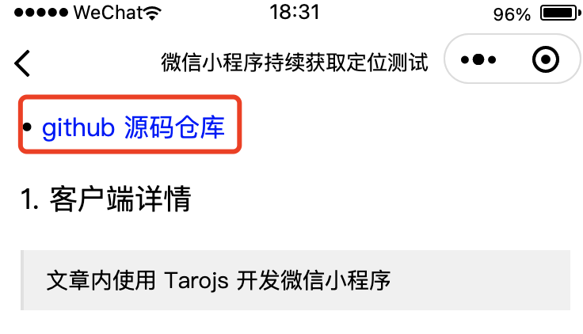
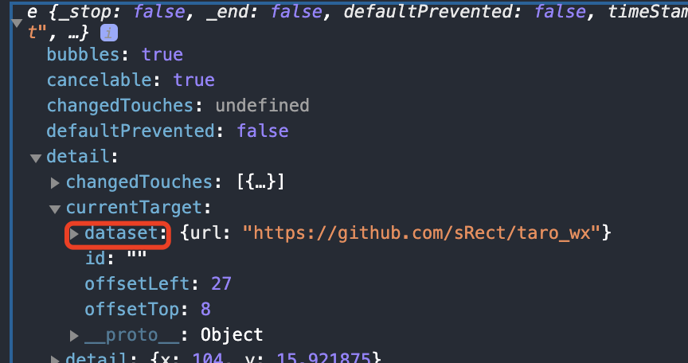

- [小程序博客 github 仓库](https://github.com/sRect/wechat-blog)

- [本小程序链接](#小程序://sRect的个人博客/sRect的个人博客/Z1MPSUtT7bnfPFd)

## 1. 需求背景

最近在做一个微信小程序版的简易博客，原本是准备自己解析`markdown`并渲染，最后还是使用了[`wemark`](https://github.com/TooBug/wemark)第三方组件来渲染，因为自己解析渲染的很难看。

因为小程序内打开第三方链接，需要在项目配置里设置域名才能打开，对于第三方网站链接很无奈，所以干脆直接进行复制，然后可以自行通过浏览器打开。

```javascript
const Detail = () => {
  const mdStr = `...`;

  return (
    <View id="md" className="markdown-body">
      <wemark id="wemark" md={mdStr} link highlight type="wemark" />
    </View>
  );
};
```



如上图显示，就是想在点击的时候，拿到链接里的 url。

其实熟悉微信小程序的开发，这是一个很简单的需求，但我等彩笔不熟悉。😄

原本还想拿到 dom，然后自己绑定事件，最后发现这样错的离谱。

## 2. 彩笔的错误之路

> **注意**： 以下几种方式都没成功

### 2.1 使用`createSelectorQuery`api

> 打印出来，都没有想要的结果，没法继续下去

```javascript
import Taro, { useReady } from "@tarojs/taro";

const Detail = () => {
  useReady(() => {
    Taro.createSelectorQuery()
      .select("#md")
      .node((res) => {
        console.log("==>");
        console.log(res);
      })
      .exec();
  });
};
```

或者

```javascript
useReady(() => {
  const query = Taro.createSelectorQuery().in(this);

  query
    .select("#md")
    .node(function (res) {
      console.log(res.node);
    })
    .exec();
});
```

### 2.2 使用`getCurrentInstance`api

> 打印出来，也没有想要的，无法继续下去

```javascript
import { getCurrentInstance } from "@tarojs/taro";

const { page } = getCurrentInstance();
const md = page.selectComponent("#md");

console.log(md);
```

### 2.3 直接在最外面绑定事件

> 打印出来，无法区分是否点击在链接上，也无法继续下去

```javascript
const Detail = () => {
  const mdStr = `...`;

  useEffect(() => {
    const el = document.getElementById("md");
    function handleClick(event) {
      console.log(event);
    }
    el.addEventListener("tap", handleClick);

    return () => {
      el.removeEventListener("tap", handleClick);
    };
  }, []);

  return (
    <View id="md" className="markdown-body">
      <wemark id="wemark" md={mdStr} link highlight type="wemark" />
    </View>
  );
};
```

## 3. 解决

> 还是得到`wemark`组件里去修改

- `wemark/wemark.js`添加如下代码

```javascript
Component({
  methods: {
    onTap: function (e) {
      console.log("onTap==>", e);
      this.triggerEvent("myevent", e);
    },
  },
});
```

- `wemark/wemark.wxml`中添加`data-url`和添加事件绑定

```html
<navigator
  class="wemark_inline_link"
  url="{{renderInline.data.href}}"
  wx:if="{{renderInline.type === 'link'}}"
  data-url="{{renderInline.data.href}}"
  bindtap="onTap"
>
  {{renderInline.content}}
</navigator>
```

- 回到自己代码中修改

```javascript
const Detail = () => {
  const mdStr = `...`;

  // 链接复制
  const onMyEvent = (e) => {
    console.log(e);

    const str = e?.detail?.currentTarget?.dataset?.url;

    if (!str) return;

    Taro.setClipboardData({
      data: str,
      success() {
        Taro.showToast({
          title: "链接复制成功",
          icon: "success",
        });
      },
    });
  };

  return (
    <View id="md" className="markdown-body">
      <wemark
        id="wemark"
        md={mdStr}
        link
        highlight
        type="wemark"
        onMyevent={onMyevent}
      />
    </View>
  );
};
```



- 至此，解决了这个小需求

## 4. 参考链接

1. [组件间通信与事件](https://developers.weixin.qq.com/miniprogram/dev/framework/custom-component/events.html)

2. [原生项目使用 Taro](https://taro-docs.jd.com/taro/docs/taro-in-miniapp/#%E7%BB%84%E4%BB%B6%E9%97%B4%E9%80%9A%E4%BF%A1%E4%B8%8E%E4%BA%8B%E4%BB%B6)
