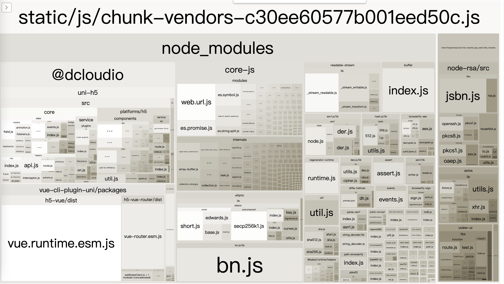
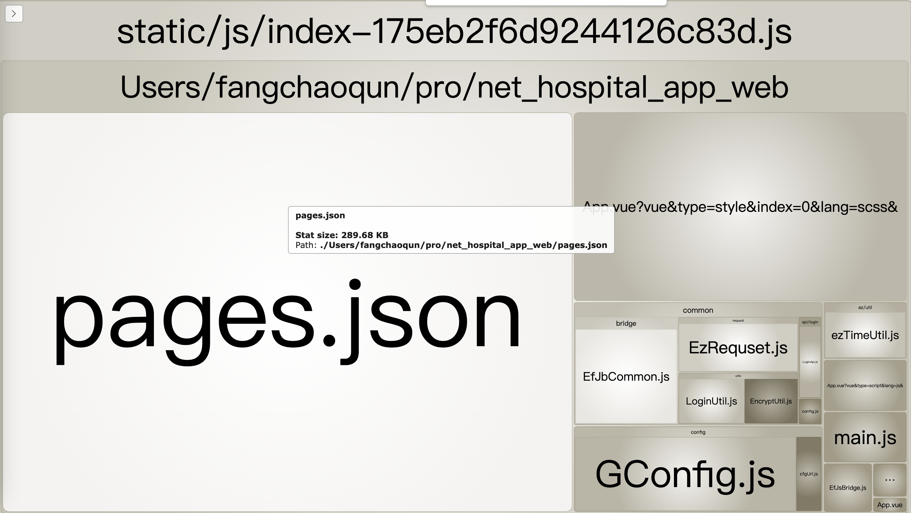
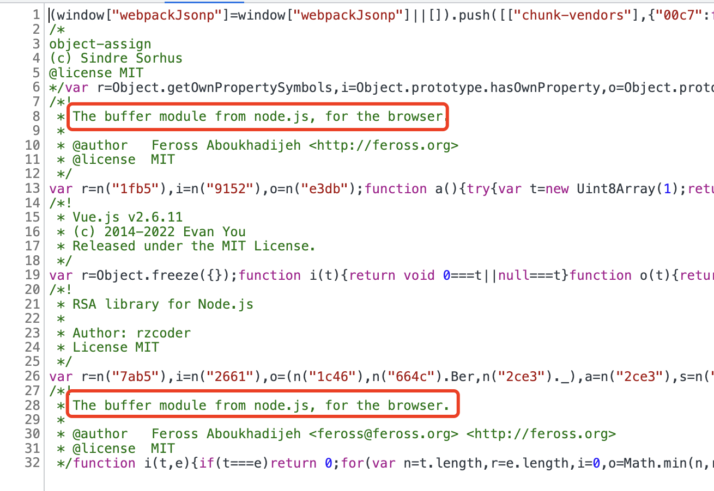
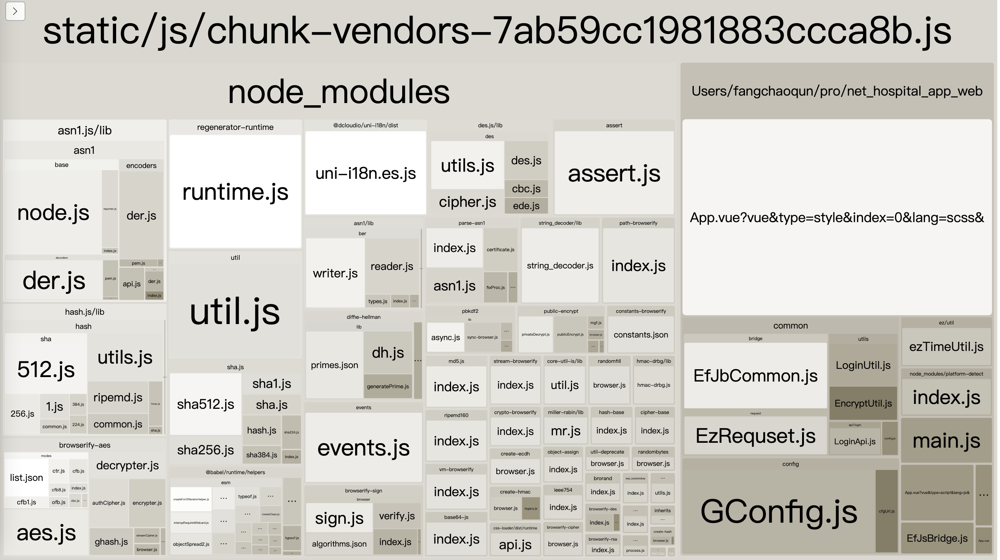
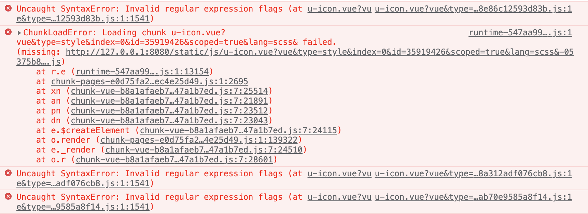
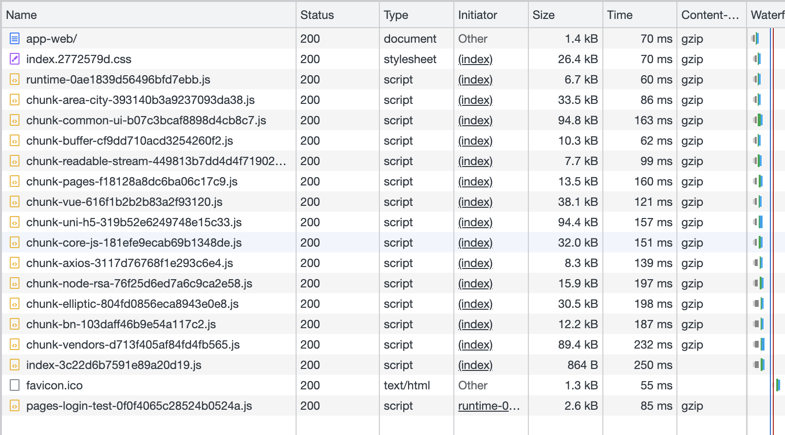

- [本文掘金链接](https://juejin.cn/post/7129492032241795080)

本文对应操作系统及 hbuilderx 版本等

| -         | -               |
| --------- | --------------- |
| 操作系统  | macOS           |
| HbuilderX | 3.4.18.20220630 |
| Vue       | 2.x             |
| uView     | 1.x             |

---

## 1. 项目背景

这是一个嵌套在 flutter 里的 h5 项目，外面壳子是 app，里面大部分的页面是 h5，app 直接用 webview 显示 h5 页面

## 2. 开发 h5 为什么要用 uniapp?

因为还要开发微信小程序，使用 uniapp，可以跨平台，节省时间

## 3. 项目初始化

项目初始化是使用[HBuilderX 可视化界面](https://uniapp.dcloud.net.cn/quickstart-hx.html)创建的项目，没有使用[vue-cli 命令行](https://uniapp.dcloud.net.cn/quickstart-cli.html)的方式。

通过官方 IDE 的方式创建的项目，这给后面项目 CI/CD 构建部署，就带来了麻烦。因为不是命令行创建的项目，没法在 linux 里执行命令，只有在本地打包完，然后上传打包完的`unpackage`目录进行部署。当然使用 HBuilderX 也有很多方便的地方。

### 3.1 uni-app HBuilderX 工程与 vue-cli 工程相互转换

[HBuilderX 工程转换为 vue-cli 工程](https://ask.dcloud.net.cn/article/35750)，看到评论区有坑，而且项目一大，遇到坑不一定能解决掉，这样代价就大了。

### 3.2 通过 HBuilderX 方式创建的项目，可以调用 hbuilderx 的打包命令吗？

也就是通过命令行调用 hbuilderx 的打包功能

- [CLI 发行 uni-app 到 H5](https://hx.dcloud.net.cn/cli/publish-h5)
- [cli 配置环境变量](https://hx.dcloud.net.cn/cli/env)

但是这样还是没有一开始通过 vue-cli 命令行的方式方便，而且都是在本地 windows 或者 mac 上打包，没法在 linux 上通过 shell 脚本执行打包。最终只能是本地打包完，上传 git 仓库。这里有优雅的解决方式的，评论区分享下。

### 3.3 通过 HBuilderX 方式创建的项目，可以使用 npm 吗？

官方文档明确说，可以的

## 4. 生产打包去除`console`

[官方文档](https://uniapp.dcloud.net.cn/collocation/vue-config.html)

```javascript
// vue.config.js

module.exports = {
  chainWebpack: (config) => {
    // 发行或运行时启用了压缩时会生效
    config.optimization.minimizer("terser").tap((args) => {
      const compress = args[0].terserOptions.compress;
      // 非 App 平台移除 console 代码(包含所有 console 方法，如 log,debug,info...)
      compress.drop_console = true;
      compress.pure_funcs = [
        "__f__", // App 平台 vue 移除日志代码
        // 'console.debug' // 可移除指定的 console 方法
      ];
      return args;
    });
  },
};
```

## 5. HBuilderX 创建的项目打包时如何区分环境？

意思就是，如何像执行`npm run build:dev`执行的测试环境打包，`npm run build:prod`执行的是生产环境打包。

[官方文档](https://uniapp.dcloud.net.cn/collocation/package.html#%E6%A6%82%E8%BF%B0)

自定义发行-package.json 中添加配置

```json
{
  "uni-app": {
    "scripts": {
      "h5-prod": {
        "title": "h5:prod",
        "browser": "",
        "env": {
          "UNI_PLATFORM": "h5",
          "NODE_ENV": "production",
          "DEPLOY_ENV": "prod"
        },
        "define": {
          "CUSTOM-CONST": true
        }
      },
      "h5-dev": {
        "title": "h5:dev",
        "browser": "",
        "env": {
          "UNI_PLATFORM": "h5",
          "NODE_ENV": "development",
          "DEPLOY_ENV": "dev"
        },
        "define": {
          "CUSTOM-CONST": true
        }
      }
    }
  }
}
```

添加后，本地开发，就可以在菜单`运行 - h5:dev`本地启动项目，`发行 - 自定义发行 - h5:dev`测试环境打包，当然点击`发行 - 自定义发行 - h5:prod`是生产环境打包。

## 6. 根目录`vue.config.js`中如何获取到自定义 `process` 变量？

因为想在测试环境打包时保留代码中的 debugger 日志，生产环境打包的时候去除日志打印。

像上面定义的`process.env.DEPLOY_ENV`这个变量，业务代码中可以正常获取到，但是在 vue.config.js 这个配置文件中拿不到。

1. 安装`dotenv`

```bash
npm i dotenv -D
```

2. 修改`vue.config.js`

```javascript
require("dotenv").config();

module.exports = {
  chainWebpack(config) {
    config.when(process.env.NODE_ENV === "production", (config) => {
      // 我们可以拿到process.env.UNI_SCRIPT这个变量来进行操作
      if (process.env.UNI_SCRIPT === "h5-prod") {
        // https://uniapp.dcloud.io/collocation/vue-config.html
        // 发行或运行时启用了压缩时会生效
        config.optimization.minimizer("terser").tap((args) => {
          const compress = args[0].terserOptions.compress;
          compress.drop_console = true;
          compress.pure_funcs = [
            "__f__", // App 平台 vue 移除日志代码
          ];
          return args;
        });
      }
    });
  },
};
```

## 7. 打包 h5 过后文件名过长问题

项目稍微大点，页面目录嵌套深一点，打包出来的文件名称巨长，甚至达到 100 字符长度以上。文件名过长，就会带来很恶心的问题，比如被 nginx 拦截，拿不到文件内容，导致页面挂掉。

```javascript
// vue.config.js
module.exports = {
  chainWebpack: (config) => {
    config.when(process.env.NODE_ENV === "production", (config) => {
      config.output
        .filename("static/js/[name]-[contenthash].js")
        .chunkFilename("static/js/[id]-[chunkhash].js");
    });

    config.optimization.splitChunks({
      name: function (module, chunks, cacheGroupKey) {
        const moduleFileName = module
          .identifier()
          .split("/")
          .reduceRight((item) => item);
        const allChunksNames = chunks.map((item) => item.name).join("~");
        return `${moduleFileName}`;
      },
    });
  },
};
```

## 8. 打包 h5 后`chunk-vendors`文件体积过大，而且页面部署后打开也很慢

庆幸的是，暴露了`vue.config.js`这个文件交给开发者，不然处理起来真的头大。

### 8.1 首先启用`manifest.json`配置文件中的`tree-shaking`配置，“摇掉”那些冗余代码

### 8.2 移除 prefetch 插件

```javascript
// 这个视自己的项目而定
// vue.config.js
module.exports = {
  chainWebpack: (config) => {
    // 移除 prefetch 插件
    // https://cli.vuejs.org/zh/guide/html-and-static-assets.html#prefetch
    config.plugins.delete("prefetch");
  },
};
```

### 8.3 打包进行 gz 或 br 压缩

1. 安装`compression-webpack-plugin`

> 这里有一个问题，7.x 版本后只支持 webpack5.x 版本，这里是 webpack4.x，只能使用 6.x 版本
> https://github.com/webpack-contrib/compression-webpack-plugin/releases?page=2

```txt
7.0.0 (2020-12-02)

BREAKING CHANGES
  minimum supported webpack version is ^5.1.0
```

安装

```bash
npm i compression-webpack-plugin@6.1.1 -D
```

2. 修改 vue.config.js

```javascript
// vue.config.js
const CompressionPlugin = require("compression-webpack-plugin");

module.exports = {
  configureWebpack: (config) => {
    if (process.env.NODE_ENV === "production") {
      config.plugins.push(
        new CompressionPlugin({
          filename: "[path][base].gz",
          algorithm: "gzip",
          test: /\.(js|css|html)$/,
          threshold: 10240,
          minRatio: 0.8,
          deleteOriginalAssets: false,
        })
      );
    }
  },
};
```

3. 同时 nginx 开启 gzip

```nginx
server {
  gzip on; #开启gzip
  # gzip_buffers 32 4k; #设置压缩所需要的缓冲区大小，以4k为单位，如果文件为32k则申请32*4k的缓冲区
  gzip_comp_level 6; #gzip 压缩级别，1-9，数字越大压缩的越好，也越占用CPU时间
  gzip_min_length 4000; #gizp压缩起点，文件大于4k才进行压缩
  gzip_vary on; # 是否在http header中添加Vary: Accept-Encoding，建议开启
  gzip_static on; #nginx对于静态文件的处理模块，开启后会寻找以.gz结尾的文件，直接返回，不会占用cpu进行压缩，如果找不到则不进行压缩
  # gzip_types text/xml text/javascript application/javascript text/css text/plain application/json application/x-javascript; # 进行压缩的文件类型
}
```

### 8.4 结合`webpack-bundle-analyzer`生成的模块分析图来拆分 chunk-vendors

#### 8.4.1 安装`webpack-bundle-analyzer`

```bash
npm i webpack-bundle-analyzer -D
```

#### 8.4.2 引入`webpack-bundle-analyzer`

```javascript
const BundleAnalyzerPlugin =
  require("webpack-bundle-analyzer").BundleAnalyzerPlugin;

module.exports = {
  configureWebpack: (config) => {
    config.plugins.push(new BundleAnalyzerPlugin());
  },
};
```

如下图所示,chunk-vendors 的组成，是把那些公共的依赖全部都打包在一起了，文件大小达到 1M 以上，严重影响页面加载速度，生成环境上 gzip 压缩后，首页加载也需要将近 10s 左右，令人汗颜。(这里的拆分视具体项目而定)



- 需要将`@dcloudio`(658kb)拆分为"uni-h5"部分和"vue-cli-plugin-uni"部分
- 将`core-js`(282kb)单独拆出来
- 将`node-rsa`(112kb)单独拆出来
- 将`bn.js`(88kb)单独拆出来
- ...

入口 index 文件也达到了几乎 350kb，里面有一个大的 pages.json 文件



- 将`pages.json`(290kb)单独拆出来

在浏览器上看 chunk-vendors，还有一个`buffer`模块



- 将`buffer`模块单独拆出来

#### 8.4.3 `optimization.splitChunks`拆分模块

> 这里是 webpack4

```javascript
// vue.config.js
module.exports = {
  chainWebpack: (config) => {
    config.optimization.splitChunks({
      chunks: "all", // 必须三选一： "initial"(同步包) | "all"(推荐，同步或异步包) | "async" (默认就是async，异步包)
      automaticNameDelimiter: "~", // 打包分隔符
      name: function (module, chunks, cacheGroupKey) {
        const moduleFileName = module
          .identifier()
          .split("/")
          .reduceRight((item) => item);
        const allChunksNames = chunks.map((item) => item.name).join("~");
        return `${moduleFileName}`;
      },
      cacheGroups: {
        vendors: {
          name: "chunk-vendors",
          chunks: "initial",
          reuseExistingChunk: true,
          enforce: true, // 遇到重复包直接引用，不重新打包
          priority: 0, // 打包优先级权重值
          // minChunks: 1,  // 引用超过一次直接打包到chunk中
          minSize: 30000,
        },
        pages: {
          name: "chunk-pages",
          test: /pages\.json$/,
          chunks: "all",
          reuseExistingChunk: true,
          enforce: true,
          priority: 90,
          minChunks: 1,
          minSize: 10000,
        },
        "node-rsa": {
          name: "chunk-node-rsa",
          test: /node-rsa/,
          chunks: "all",
          reuseExistingChunk: true,
          enforce: true,
          priority: 70,
        },
        buffer: {
          name: "chunk-buffer",
          test: /buffer|is-buffer/,
          chunks: "all",
          reuseExistingChunk: true,
          priority: 90,
          minChunks: 1,
          minSize: 15000,
          enforce: true,
        },
        "core-js": {
          name: "chunk-core-js",
          test: /core-js/,
          chunks: "initial",
          reuseExistingChunk: true,
          enforce: true,
          priority: 70,
        },
        "uni-h5": {
          name: "chunk-uni-h5",
          test: /uni-h5/,
          chunks: "initial",
          reuseExistingChunk: true,
          enforce: true,
          priority: 80,
        },
        vue: {
          name: "chunk-vue",
          test: /vue-cli-plugin-uni/,
          chunks: "initial",
          reuseExistingChunk: true,
          enforce: true,
          priority: 85,
        },
        bn: {
          name: "chunk-bn",
          test: /bn/,
          chunks: "initial",
          reuseExistingChunk: true,
          enforce: true,
          priority: 70,
        },
      },
    });

    // 提取公共的runtime
    config.optimization.runtimeChunk("single");
  },
};
```

#### 8.4.4 拆分的 chunk 没有在`index.html`中自动引入

> 打包很成功，没任何报错，但是在运行项目的时候，页面一片空白，没任何 ui 展示。**问题就出在，拆分出来的各个小 chunk，没有自动在 index.html 中引入**，我们可以在打包出来的 unpackage 目录，本地启动一个静态服务，把那些 chunk 手动引入，刷新页面，页面 ui 显示出来了

**所以我们需要找到[html-webpack-plugin](https://www.npmjs.com/package/html-webpack-plugin)的配置，把我们单独拆分出来的 chunk，添加到`chunks`配置中**

```javascript
// vue.config.js
function changeHtmlWebpackPluginChunks(config) {
  const plugins = config.plugins;
  const chunkArr = [
    "runtime",
    "chunk-vue",
    "chunk-uni-h5",
    "chunk-core-js",
    "chunk-node-rsa",
    "chunk-buffer",
    "chunk-bn",
    "chunk-pages",
  ];

  plugins.forEach((item, index) => {
    // 为HtmlWebpackPlugin
    if (
      item.options &&
      Object.prototype.toString.call(item.options) === "[object Object]" &&
      Object.hasOwnProperty.call(item.options, "filename") &&
      Object.hasOwnProperty.call(item.options, "chunks") &&
      item.options.filename === "index.html"
    ) {
      const oldChunks = item.options.chunks || [];
      // 修改chunks引入
      item.options.chunks = [...chunkArr, ...oldChunks];
    }
  });
}

module.exports = {
  configureWebpack: (config) => {
    if (process.env.NODE_ENV === "production") {
      changeHtmlWebpackPluginChunks(config);
    }
  },
};
```

下图是拆分后 chunk-vendors，和之前对比，那些大模块都被拆分出去了，文件体积也从 1M 多变成了 320kb，首页加载也从 10s 多变成了 3s 左右。



#### 8.4.5 关于拆分 vendors 后，`uview-ui`部分组件报错

> 项目中使用到了`uview-ui`ui 框架

重新打包，本地再次启动项目，浏览器控制台发现如下报错



再到 unpackage 目录一看，居然还有`u-icon.vue`和`u-line.vue`未打包！

那单独提取这两个文件为 chunk 进行打包，再次打包后启动项目，这两个组件没报错，其他组件报错了，unpackage 目录里出现了更多的"u-xx.vue"组件，这是什么情况？

猜测是引入 uview-ui 框架时的[easycom 组件模式](https://v1.uviewui.com/components/npmSetting.html)惹得鬼，我尝试着在 easycom 里添加自定义`custom`配置，把这两个组件写在里面，但是不管用。页面不报错，但是样式出问题了。。。

或者直接删除 easycom 配置进行，启动项目，页面样式出问题了。。。

最终还是在`splitChunks`里单独提取 uview-ui 为 chunk，这样问题是解决了，但是这样在入口的时候，就要加载一个提取出来的 uview-ui(项目中使用到的所有 uview-ui 组件，并非整个 uview-ui)。未拆分前，每个页面只需加载自己所需的组件，现在把所有页面的组件都提取出来了，等于是每个页面都加载了冗余的 uview-ui 组件。好在是最终页面加载速度是比之前快了。

这里有知道怎么处理的，或者有遇到相同问题的，分享下怎么处理。

#### 8.4.6 拆分为各个小 chunk 后，页面 js 请求变多了



页面 js 请求变多，对页面性能也有一定影响，所以这里拆分，视具体项目而定。

## 9. hbuilderx 创建的项目,h5 持续部署

> 这里视公司内部情况而定，我这是服务器上有现成的 nginx,也无需自己打包 docker 镜像

1. `.gitlab.yml`

> SSH_USERNAME,SSH_HOST,SSH_PASSWORD 这 3 个变量写在项目`Setting->CI/CD->Variables`里

```yml
stages:
  - build

job_build:
  stage: build
  script:
    # - sudo docker image build -t demo_h5 .
    # - sudo docker tag demo_h5 registry.cn-hangzhou.aliyuncs.com/test-blog/demo_h5:latest
    # - sudo docker login --username=$ALIYUN_DOCKER_NAME registry.cn-hangzhou.aliyuncs.com --password=$ALIYUN_DOCKER_PASSWORD
    # - sudo docker push registry.cn-hangzhou.aliyuncs.com/test-blog/demo_h5:latest
    # - sudo docker logout
    - if yum list installed | grep 'sshpass'; then echo yes; else yum -y install sshpass;fi
    - sh deploy.sh $SSH_USERNAME $SSH_HOST $SSH_PASSWORD
  tags:
    # 公司内部gitlab注册一个runner,或者写一个公共runner
    - xxxx
  only:
    - main
```

2. `deploy.sh`

> 将打包出来的文件，上传到服务器指定目录，然后页面就可以访问了
>
> 为什么要将打包出来的代码进行压缩，因为打包出来的文件数量很多，如果一个个传输，会非常慢，所以要进行压缩后变成 1 个文件进行传输

```sh
#!/bin/bash

echo "ssh deploy start==>"
# echo "$3" ssh "$1"@"$2" --password-stdin

username=$1
host=$2
password=$3
# 打包目录
dir="./unpackage/dist/build/h5"
# 服务器目录
target="/home/demo_h5/nginx/html/app-web"

# 上传本地文件到服务器
# scp /path/filename username@servername:/path
# 上传目录到服务器
# scp -r local_dir username@servername:remote_dir

# sshpass -p ${password} scp ${dir}/index.html ${username}@${host}:/home/demo_h5/nginx/html/app-web
# sshpass -p ${password} scp -r ${dir}/static ${username}@${host}:/home/demo_h5/nginx/html/app-web

# cd到指定目录
cd ${dir}
# 压缩所有文件并重命名
zip -r -q -o build.zip ./
# 通过sshpass上传压缩文件到指定目录
sshpass -p ${password} scp ./build.zip ${username}@${host}:${target}
sleep 2

# 登录远程服务器
# cd 到指定目录
# unzip 解压到指定目录
#   -o 不必先询问用户，unzip执行后覆盖原有文件。
#   -d 解压到指定目录
# 删除压缩文件

sshpass -p ${password} ssh ${username}@${host} "cd /home/demo_h5/nginx/html/app-web && pwd && unzip -o -q ./build.zip -d ./ && rm -rf ./build.zip"

echo "ssh deploy end==>"
```

3. git 提交代码

不出意外，代码自动部署到相应位置，浏览器可以访问了

```log
$ if yum list installed | grep 'sshpass'; then echo yes; else yum -y install sshpass;fi
Repository base is listed more than once in the configuration
Repository updates is listed more than once in the configuration
Repository extras is listed more than once in the configuration
Repository centosplus is listed more than once in the configuration
Repodata is over 2 weeks old. Install yum-cron? Or run: yum makecache fast
sshpass.x86_64                              1.06-2.el7                 @extras
yes
$ sh deploy.sh $SSH_USERNAME $SSH_HOST $SSH_PASSWORD
ssh deploy start==>
/home/demo_h5/nginx/html/app-web
ssh deploy end==>
Job succeeded
```

## 10. 参考资料

1. [uniapp 官方文档](https://uniapp.dcloud.net.cn/)
2. [webpack4 官方文档](https://v4.webpack.docschina.org/concepts/)
3. [vue-cli 官方文档](https://cli.vuejs.org/zh/guide/)
